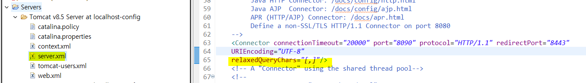
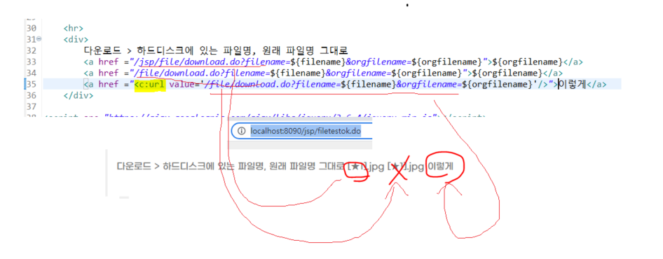
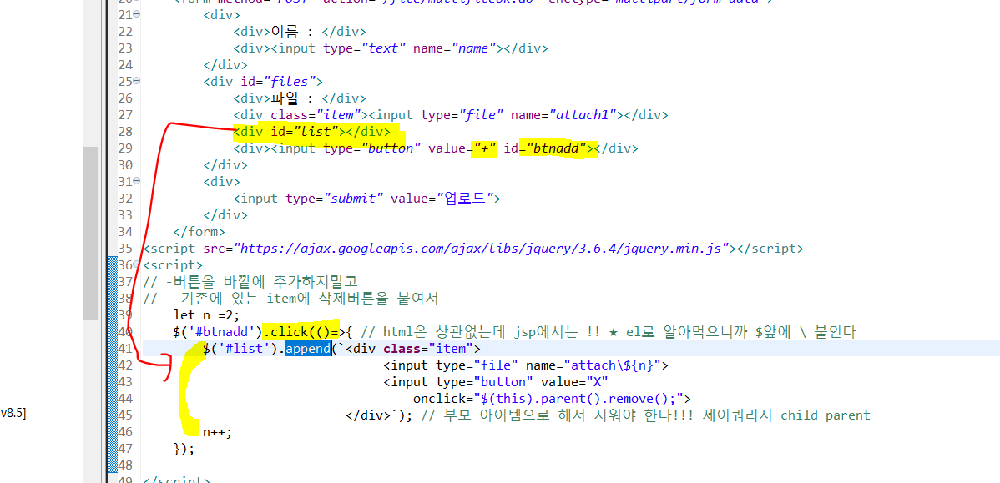
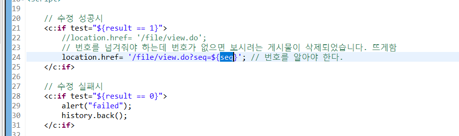
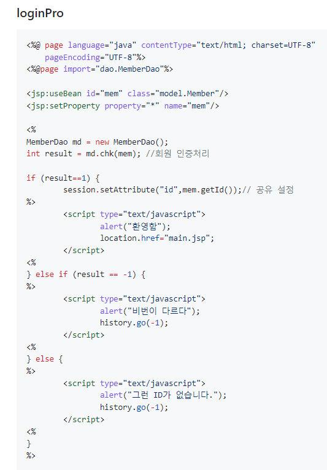
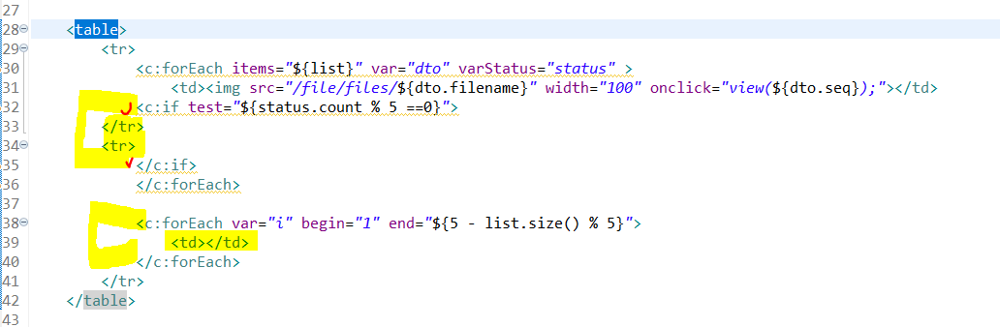

# ServerBasic
## 복습용 README.md
> 리드미 한 페이지로 수업내용요약 및 복습, 정리 + 개인적인 공부로 추가적인 내용도 붙을 수 있음

## 1. 서블렛(Servlet)
- 웹서버측에서 자바를 사용한 프로그램을 동작시키는 기술(환경)이다. 
- 목적) 클라이언트의 요청에 따른 동적 웹페이지 생성을 위함
- HTML, CSS, JavaScript로 만든 정적페이지와는 다르게 동적 페이지는 요청이 들어올 때마다 적합한 페이지를 그 즉시 만들어 준다. 

> 정적 페이지는 공산품 캔커피, 동적 페이지는 알바생이 만들어주는 것


## 2. Servlet Class(서블릿 클래스)
- 자바클래스다.
- 서블릿이 알바생이다. 
- 정의된 틀이 있고 이것대로 우리가 구현하면 된다. 
1. 서블릿 클래스 선언 
   * javax.servlet.Servlet 인터페이스를 구현(복잡)
   * javax.servlet.http.HttpServlet 클래스를 상속(이 방법이 무난하다.)
   * > HttpServlet가 Servlet인터페이스로 구현

   * 작성법 > 기본적으로 service코드를 작성해야 한다. doGet, doPost
   * 매개변수 2개 
     * 1. java.servlet.http.HttpServletRequest
     * 2. java.servlet.http.HttpServletResponse
   * 예외미루기
     * 1. java.io.IOException    // 페이지를 동적으로 생성 > 외부 입출력 
     * 2. javax.servlet.ServletException; // 서블릿 작업 때문에
  
## 3. 서블릿작성 
``` java
public class Ex02 extends HttpServlet {
    public void doGet(HttpServletRequest request,
                HttpServletResponse response) throws IOException, ServletException{
                    
                    response.setCharacterEncoding("UTF-8"); // 브라우저에 보이는 인코딩 설정
			        PrintWriter writer = response.getWriter();

                    writer.println("<html>");
                    ...
                    writer.println("</html>");

                    writer.close();
                }
}

```

## 4. 서블릿 작성 예시 + 추가
- 서블릿은 아래의 메서드를 오버라이드하여 작성할 수 있다.
- doGet은 Get요청만, doPost는 Post요청만 가능하다.
- init은 서블릿이 처음 요청될 때 초기화를 하는 메서드
- service는 서블릿 컨테이너가 요청을 받고 응답을 내려줄 때 필요한 서블릿의 service메서드 > doGet, doPost이런거다.
- destory는 더 이상 사용되지 않는 서블릿 클래스는 주기적으로 서블릿 컨테이너가 destory 메서드를 호출해서 제거 
```java
public class myServlet extends HttpServlet {

    @Override
    public void init(ServletConfig config) throws ServletException {
        System.out.println("init method 호출!");
    }
    
    @Override
    public void destroy() {
        System.out.println("destroy method 호출!");
    }
    
    @Override
    protected void doGet(HttpServletRequest request, HttpServletResponse response)
        throws ServletException, IOException
    {
        System.out.println("doGet service method 호출!");		
    }
    
    @Override
    protected void doPost(HttpServletRequest request, HttpServletResponse response)
        throws ServletException, IOException
    {
        System.out.println("doPost service method 호출!");		
    }
	
}
```

## 5. web.xml
```xml
다음과 같이 web.xml 파일에 > 자바 파일(서블릿, 알바생)을 호출할 수 있는 가상주소를 맵핑한다.
    <servlet> //서블릿 클래스를 서블릿으로 등록
           <servlet-name>ex03</servlet-name> //해당 서블릿을 참조할 때 사용할 이름
           <servlet-class>com.test.servlet.Ex03</servlet-class> //서블릿으로 사용할 서블릿 클래스의 FullName
     </servlet>
     <!--
         위 서블릿을 등록, url 패턴을 지정해준다.
         동작되는 url은 contextRoot 밑으로 동작된다. 
      -->
     <servlet-mapping>
           <servlet-name>ex03</servlet-name> //매핑할 서블릿의 이름
           <url-pattern>/ex03</url-pattern> //매핑할 URL 패턴
     </servlet-mapping>
```

## 6. 서블릿 동작흐름 


먼저 우리가 톰켓이라는 걸 실행시켜놓는다. 그 후에 Ex03.java 코드를 작성하고 web.xml파일 작성하고 컴파일해놓아서 메모리에 올려놓는다. 그 후 브라우저는 http//컨텍스트루트/ex03로 요청을 보내면 톰켓 서버는 web.xml을 뒤진다. 맞는 URL패턴에 클래스를 실행시켜주려고 하는 것이다. 그래서 맞는 것을 실행시켜주는 것이다. Ex03은 doGet()를 작성했다. 서블릿 컨테이너는 서블릿 인스턴스를 생성하고 doGet()을 호출시켜 doGet()에서 만드는 임시페이지를 서버 톰켓으로 전송한다. 톰켓은 HTTP response로 클라이언트쪽으로 전송하는데 이 페이지를 우리는 캐싱해놓고 캐싱해놓은 페이지를 브라우저는 우리에게 보여준다.
* 또다른 특징 : java의 스레드 사용, MVC 패턴이용 등

* 만약 다시 동일 페이지 호출시 : 재컴파일을 하지 않고 서블릿이 호출

* 소스가 바뀌면 서블릿을 재 컴파일
* 자바쪽 소스가 많다. > 이게 메인임 클라이언트쪽 소스 다루기가 빡쌔다...

## 7 . JSP. Java Server Page
- 자바를 사용해서 서버측에서 페이지를 만드는 기술, Servlet의 다음 버전
- Servlet vs JSP
  - Servlet은 자바코드에서 시작, 자바 베이스 코드 작성 관리가 용이한데 Html 코드를 문자열 취급해서 넣어줘서 클라이언트 코드쪽 작성이 불편하다. 그리고 web.xml에 가상주소 매핑이 필요하다. 
  - JSP는 HTML 코드쪽에서 시작한다. 클라이언트 코드 작성이 쉽다. web.xml 가상주소 매핑이 필요없다. webapp에 .jsp파일을 작성하고 URL을 그쪽으로 쏴주면 된다. 
  - 코드 작성 영역상의 차이가 조금 있고 기술적인 개념은 비슷한점이 많다. 
- JSP + Servlet을 섞어서 쓸 수 있다.
  - 서블릿 : 자바 코드 담당
  - JSP : 클라이언트 코드 담당
  - 너무 한쪽만 쓰면 코드관리도 어렵고 유지 보수가 어려우니 둘이 떼어놔서 각각 좀더 편한쪽에서 쓰는 것이라 생각함

## 8. JSP 구성요소 
- JSP 지시자, JSP Directive
  - page 지시자, include 지시자, taglib 지시자
  - <%@ page language="java" contentType="text/html; charset=UTF-8" pageEncoding="UTF-8"%> 
  - language="java" : 현재 페이지를 처리하는 서버측 언어가 java
  - contentType="text/html; charset=UTF-8" : 브라우저에게 돌려줄 임시 페이지에 관련된 설정, 니가 받아볼 페이지는 utf-8, html
  - pageEncoding="UTF-8" : ★ 현재 JSP 페이지의 인코딩
  - 이것들 utf-8 설정안하면 글자깨지니까 조심하기
  - <%@page import = "java.util.*" %>

- 스크립트 요소, Scripting Elements
  - 스크립틀릿 <%     %>  Scriptlet > : 맨위쪽에 쓰는 경우는 자바프로세싱 관련 코드를 구현할 때고 태그 사이에 중간 중간 for문을 돌리기 위해 넣기도 한다. 
  - 익스프래션 <%= 값 %>  Expression 해당 위치에서 값을 출력하는 용도이다. 
- 선언부 : 스크립틀릿이나 익스프래션은 잘쓰는데 이건 잘 안쓴다. 
  - <%! %> :꺽쇠느낌표이다. 스크립틀릿 안에서는 메서드가 안만들어진다. 그리고 스크립틀릿 안에선 지역변수가 만들어짐, 변수 셋팅은 가능한데...
  - 근데 선언부 쪽은 메서드가 만들어진다. 근데 이게 현재 페이지에서만 유효함 
  - 선언부는 전역변수 선언이나, 메서드 정의 목적으로 사용하나 어차피 메서드는 라이브러리 가져다 쓰니까 import 쓸거고 해서 크게 필요성이 떨어진다.
  - 스크립틀릿에서 만들어진 변수는 지역변수인데 이것은 요청에 따른 _jspService()와 생명주기를 같이하고 선언부의 전역변수는 객체 생성, 소멸과 생명주기를 같이한다. ex) 두 변수를 증감연산으로 새로고침했을 때 전역변수는 계속 증가될거고 지역변수는 요청단위라 그대로다.

## 9. JSP 내장 객체 > JSP Implicit Object
- 개발자가 직접 생성하는 객체가 아니라, JSP(톰켓)이 미리 만들어서 제공하는 객체이다.
- JSP>변환>java파일>컴파일>class파일>서블릿객체가 페이지생성>톰켓이 받아서 브라우저쪽으로 전달
- Run on server하는 순간 jsp가 변환된 java파일은 class파일과 함께 .metadata>plugins>org.ecplise.wst.server.core>tmp0>work>Catalina>localhost>jsp>org>apache>jsp 이쪽에 들어온다. > 이쪽 java파일에서 정의된 것이 기본객체다.!


- 기본 객체 종류 request, response, session, pageContext,out, application, config, page, exception 등.. 
  
- pageContect, request, session, application 
  - 데이터 저장하는 목적으로 사용한다. map같은 느낌으로 쓴다. 
  - 내장객체.setAttribute(key, value);
  - 내장객체.setAttribute(key);
  - map으로도 전달이 가능하다. 배열도 전달가능, 시간도 전달가능, "a,b,c,d"와 같이 csv 형식으로도 전달이 가능하다.
  - 이 4가지는 범위개념을 가진다. 'Scope'
  
1. request > 클라이언트쪽에서 url로 뭔가 보냄
   * 전송된 데이터를 가져올 때 사용, ( get이나 post로 전송되는 데이터 꺼낼 때 )
   * A페이지에서 B페이지로 데이터가 옴 그러면 해당 B페이지에 request 객체에서는 getParameter로 데이터를 꺼내볼 수 있다.
   * 근데 이게 데이터 인코딩을 셋팅을 안하면 데이터가 깨져나올 수 있으니 받는 페이지에서 getParameter 하기전에 인코딩을 잘 설정하자.
   * 전송된 데이터 인코딩 request.setCharacterEncoding("UTF-8");
   * 요청 관련 정보도 얻어올 수 있다. 요청한 사람의 ip나 method나, 프로토콜이나 기타 등등 요청헤더정보 꺼내보는 메서드가 있음
   * request.getContextPath() 등~ 
  ``` java
  	<% Enumeration<String> e= request.getHeaderNames();
			while(e.hasMoreElements()){
				String name = e.nextElement(); //nextElement()로 다음거 꺼낸다.
		%>
		<tr>
			<td><%= name %></td>
			<td><%= request.getHeader(name)%></td>
		</tr>
		<%
			}
		%>
  ```
2. response > 서버>(행동)>클라이언트
   * response는 서블릿에서 브라우저로 보여줄 페이지를 만드는과정에서 getWriter()호출하고 호출하는 페이지의 인코딩 셋팅을 했었다. 
   * jsp단에서는 response.sendRedirect("ex11_response_two.jsp"); 이렇게 자바코드에서 리다이렉트 코드를 작성할 수 있다. 
   * 그리고 돌려줄 내용의 MIME을 지정한다. 이건 파일 업로드 과정에서 다룬다.
3. pageContext
   * 페이지 실행(요청~응답) 중에 관련된 데이터를 저장하는 객체인데
   * 페이지내에서만 유요한 객체임 그래서 pageContext
   * pageContext.forward()라는 메서드를 forward하기 위해 쓴다. 

4. out
   * out이라는 객체는 출력용도이다. 서블릿에서 response의 PrintWriter와 비슷한 역할이다. jspWriter로 만든 것임. 스크립틀릿 중간중간에 넣어쓸래? 아니면 한방에 쓸래?의 차이이다. 딱히 필요성은 못느끼겠음 아직까진??

``` java
    <h1>구구단</h1>
	<%
		int dan = 5;
	%>
	
	<h2>out 사용 안함 </h2>
	<% for ( int i=1 ; i<=9 ; i++) { %>
	
	<div><%= dan %>  x <%= i %> = <%= dan * i %></div>
	
	<% } %>
	
	<h2>out 사용함 > 우리에게 선택권을 주는 것이다. </h2>
	<% for ( int i=1; i <=9 ; i++ ) { 
		out.println(String.format("<div> %d x %d = %d </div>",
				dan,
				i,
				dan*i)); 
                // 서블릿이 하던 방식이다. 출력용도인데 기본객체니까 import 필요 없네 
	}
	%>
```
5. session(개별)
   * 전역변수 > 접속 종료전까지 계속 유지, 한번 만들어놓으면 사이트 전체에서 이용가능
   * session.getId() : 세션 식별자
   * session.isNew() : 세션이 방금 만들어졌나?
   * long tick = session.getCreationTime(); : 세션 생성시간 tick값이라 Date 객체로 시간 따로 처리해야함
   * session.setAttribute("d", 40);      : session에 "d"라는 key로 40저장
   * session.getAttribute("d")           : "d"라는 key로 값 꺼냄
   * session.setMaxInactiveInterval(30); : 만료시간 셋팅 > 사이트에 따라 만료시간 설정은 다를 수 있다. 
   * session.invalidate();               : 세션을 초기화. 로그아웃할 때 쓴다고 함, 그럼 removeAttribute는?
   * session.removeAttribute("data");    : 해당 키의 어떤 세션값을 지운다.
   * > 서버에서 만들어진다.  이거 인증이런데에다가 유저 id 넣고 하는데 쓰긴한다. 근데 유저가 한 두명이 아니다. 유저 10000명 세션 자체도 한정된 공간이고 메모리? 꽉차면 서버 다운될 수 도 있음 > 조심해서 써야함 > 서버가 클라이언트마다 개별적으로 부여
6. application(공용) > 얘도 데이터를 저장하진 않음 설정파일, 기타 db설정등 저장하는 용도로 쓴다. 
   * 세션과 성질은 비슷한데 큰 차이가 있음 여기는 공용 공간임 A유저, B유저가 같은 application에 저장된 데이터를 볼 수 있다.
   * 얘도 만료기간이 있다. 서버에 사용자가 들어올 때마다 만료기간 초기화 가능한데 가끔 사람이 몇시간 동안 안오면 이값이 사라지는 것.


> 쿠키는 Java Servlet단에서든, Javascript단에서든 조작이 가능함
7. Cookie(쿠키)
   * 개인 정보를 저장하는 저장소
   * 브라우저가 관리하는 저장소이다.
   * 서버 부담이 없다. 
   * 서블릿, 자바 단에서든, javascript 클라이언트 단에서든 쿠키를 조작할 수 있다.
   * 쿠키 종류 
     * 메모리쿠키(session cookie)
       * 메모리에 저장되고, 디스크엔 저장이 안됨
       * 브라우저가 실행중에만 저장
       * 브라우저가 종료되면 쿠키도 삭제
       * 은행 사이트 같은 경우엔 아이디를 기억하면 안됨 
       * Expires/ Max-Age부분이 Session이면 Session쿠키
     * 하드쿠키(persistent cookie)
       * 브라우저가 종료되도 유지
       * 하드디스크에 저장
       * Expires/ Max-Age부분이 특정한 기간이 기록
       * w3school cookie 예제 > javascript로 쿠키 저장
```js 
function setCookie(cname, cvalue, exdays) {
  const d = new Date();
  d.setTime(d.getTime() + (exdays * 24 * 60 * 60 * 1000));
  let expires = "expires="+d.toUTCString();
  document.cookie = cname + "=" + cvalue + ";" + expires + ";path=/";
} // cookie는 key value로 내용을 저장하는 것 

function getCookie(cname) {
  let name = cname + "=";
  let ca = document.cookie.split(';');
  for(let i = 0; i < ca.length; i++) { 
    let c = ca[i];
    while (c.charAt(0) == ' ') { // trim 하고 value 리턴
      c = c.substring(1);
    }
    if (c.indexOf(name) == 0) {
      return c.substring(name.length, c.length);
    }
  }
  return "";
}
```
  * 쿠키의 삭제 (위의 javascript 코드 기준)
 ``` js
 // 이 방식으로 쿠키를 삭제하는 법은 따로 없다.
setCookie('id', null, -1); 로 value를 null 넣고 시간 -1로 셋팅해야 한다.
 ```
  * 자바코드에서 쿠키를 생성하기 
``` java
// 자바 코드에선 
Cookie cookie = new Cookie("color", "blue");
response.addCookie(cookie);            // 이렇게 쿠키를 저장한다. > response에서 저장

Cookie[] list = request.getCookies();  // 쿠키를 확인하려면 > request 객체에서 확인

for(Cookie c : list){ // 객체를 기반으로 한 쿠키도 역시 key, value였다.
		System.out.println(c.getName() +","+ c.getValue());
}
```
https://m.blog.naver.com/pjok1122/221726178384 : 여기 사이트 좋은 정보 많음

> DB 작업 시
> * DB를 사용하려면 ojdbc6.jar 파일을 참조할 수 있도록 원래는 build path를 지정해야 한다. 근데 따로 지정할 필요 없이 WEB-INF/lib/ 밑에다가 .jar파일을 저장하면 된다. 
> * 1번 방식
>   * PreparedStatement stat = null;
>   * ? 넣어서 sql 작성 , conn.prepareStatement(sql);
>   * stat.executeUpdate();
>   * int result = stat.executeUpdate();
> * 2번 방식
>   * Statement stat = null;
>   * ?없는 Sql작성 사이사이 str 넣음;
>   * stat = conn.createStatement()
>   * rs = stat.executeQuery(sql);

## ★ redirect 와 forward 개념
* Redirect > 고객, 상담원의 개념
  * 고객에 상담원에게 전화를 123번으로 함 
  * 상담원은 고객에게 해당 문의사항은 124번이라고 다시 전화하라고 함
  * 클라이언트의 요청 2번, 받은 응답 2번
  * 실질적으로 요청을 2번을 보내다보니까 만약에 처음 request에 값을 넣어보냈다면 두번째 보낼 때는 그 값이 사라진다.
  * 결과적으로 redirect된 url로 변함, 왜냐면 요청을 두번보냈으니까 두번째 보낸 요청으로 변하게 된 것임
  * CRUD 쪽에서 사용되는데 게시판 글 입력폼에서 입력ok폼으로 post 전송을 함, 입력ok폼에서 게시판 목록으로 redirect를 쏴주면 게시판 목록에선 request 내용이 없다. 이걸 유지하려면 쿼리스트링으로 또 직접 넣어줘야함
  * redirect는 항상 get요청!!
  
* Forward > 고객, 상담원의 개념
  * 고객에 상담원에게 전화를 123번으로 함 
  * 해당 상담원은 문의사항의 내용을 잘 몰라서 옆의 다른 상담원을 직접 연결함
  * 그 다른 상담원이 문의사항을 처리해줌
  * 실질적인 클라이언트의 요청은 한번이다. 고객의 전달사항(request)은 고대로 다른 상담원에게 감
  * 결과적으로 처음보냈던 url 그대로 
  * 결과적으로는 클라이언트는 다른 상담원이 준 응답을 받았는데 본인이 요청을 또 할필요가 없으니 url이 그대로 인 것
  * ★ request내에 저장된걸 들고가야할 때 사용한다. 
 

## ★ 아래의 주소록, 로그인, 로그아웃 특징은 form에서 action 처리를 .jsp 파일 쪽으로 처리한다. 이게 전형적인 Model 1방식이다. 

## 10. 주소록 CRUD
1. 업무 > 생략 
2. DB작업 > ERD(X) > 테이블 생성
3. 클라이언트 작업 > 레이아웃 + 페이지 구현 > HTML, CSS, Javascript 
	* webapp > "address" 폴더 생성
  	* > "list.jsp"    목록보기 
    	* DB에서 정보를 가져와서 목록 보여준다. Connection, Statement(), ResultSet, select seq 기준 내림차순 쿼리
    	* while(rs.next()) 반복문, rs.getString("key") 해서 중간에 html 태그 안에 넣는다.
    	* 수정, 삭제에 대한 처리를 위해서 수정, 삭제 링크 url에 쿼리스트링으로 seq를 붙여논다. 
  	* > "add.jsp"     추가하기(폼)
    	* 더미값으로 추가할 정보 input에 채움 (function() {})(); 이건 즉시호출
    	* form, input태그, addok.jsp쪽으로 action, body에 내용 채워져서 addok.jsp로 내용물 간다.
  	* > "addok.jsp"   추가하기(처리) 
    	* request.getParameter()하기 전에는 request.setCharacterEncoding("UTF-8"); 설정
    	* request.getParameter()로 꺼낸 정보를 insert sql, executeUpdate
  	* > "edit.jsp"    수정하기(폼)
    	* 이전 페이지에서 쿼리스트링으로 받은 seq를 가지고 DB에서 정보 조회
    	* 입력 폼 내용을 채워서 editok.jsp로 POST로 전송
  	* > "editok.jsp"  수정하기(처리)
    	* update 쿼리, setString은 내가 정의해주는 데이터의 타입이지 DB에서 정의한 타입은 아니다.
    	* 쿼리 result에 따라서 alert 띄우고 location.href로 redirect 
  	* > "del.jsp"     삭제하기(폼)
    	* edit과 비슷 
  	* > "delok.jsp"   삭제하기(처리)
    	* edit과 비슷
  	* > "template.jsp" 임시페이지
    	* 틀이다. 이거 복붙해서 새 페이지 작성
					
	* webapp  > address > "inc" 폴더 생성
		* > "header.jsp"
  		* 네베게이션 이런거 상단 메뉴, 다른코드 없이 '건더기' 코드만 붙인다. 잡다한 코드 제거
		* > "asset.jsp"
  		* link 코드, script 불러오기 등
		* > JSP에서 <%@ page language="java" contentType="text/html; charset=UTF-8"
		* > 불러오기 할 때 커스텀 style이나 js 코드는 cdn 아래쪽에 넣기
    pageEncoding="UTF-8"%> 는 페이지마다 붙여야 한다.
 	* webapp > address > "asset" 폴더 생성
 		* > "main.css"


## 11. 웹 보안 > 로그인, 로그아웃
* 인증, Authentication
  * 현재 접속자가 해당 사이트의 구성원인지 확인
  * 회원?이면 로그인해라

* 허가, Authorization
  * 권한을 가지고 있는지 확인한다. > 뒷구멍 url 접속(막아야함!)

* webapp > "auth" 폴더 생성
    * "index.jsp"     : 시작 페이지(초기화면)
      * <%= > 표현식에 값 안넣으면 에러나서 이걸 if(session.getAttribute("id") == null) 처리한다.
      * 정보가 있으면 session.getAttribute로 출력
    * "login.jsp"     : 로그인 폼 페이지 
      * POST 방식 전송
    * "loginok.jsp"   : 로그인 처리 페이지 > 인증 작업 
      * DB 쿼리 코드 > select로 id, pw로 쿼리 날려서 가져온 id, pw와 폼에서 입력한 id, pw가 일치하면 session에 id, name, lv를 저장
    * "logout.jsp"    : 로그아웃 페이지       
      * session.removeAttribute는 해당 key값에 대한 value를 제거
      * session.invalidate로 초기화 할 수도 있는데 이러면 아예 세션을 초기화라 모든 key, value 없앰
      * 제거 후에는 response.sendRedirect("index.jsp"); 
    * "member.jsp"    : 회원 전용 페이지 > 허가 작업 
      * 유저는 http://localhost:8090/jsp/auth/member.jsp URL을 알아낼 수 있다. 
      * 정상적이지 않은 통로로 접속이 가능한데 이걸 막으려면 
      * if(session.getAttribute("id") == null) 조건 걸어서 null이면 out.println()에 내용채워서
      * alert과 동시에 location.href로 redirect를 쏴준다. 
    * "admin.jsp"     : 관리자 전용 페이지 > 허가 작업
      * 위에다 lv 추가해서 조건달면 됨
      

## 12. Servlet + JSP > JSP Model2  

> JSP Model
1. JSP Model1(이전에 했던 것)
	- HTML + CSS + Javascript + JAVA + Servlet + JSP = *.jsp
	-> 다 한 페이지에 한방에 떄려넣는데 Model 1이다. 
	- 코드가 뒤엉켜서 > 불편하다. 실무 코드는 코드량이 매우 많다.
	
2. JSP Model2
	- Servlet : 자바 코드 작성	
	- JSP : 클라이언트 코드 작성
	- 디자인 패턴 : MVC 패턴 기반 구현
	- Model(dao쪽이나, db 작업코드), Controller(서블릿코드), View(JSP) 역할이 분명함
3. 기본적인 JSP 모델 2 
``` java
// 왜 .do가 붙을까? doGet이런 패턴을 따서 do를 붙였다고 함
// 애너테이션 등록시 xml에 가상주소를 안써도 된다.  
// 스프링도 이런 방식이 있다. 
@WebServlet("/hello.do") 
public class Hello extends HttpServlet{

	@Override
	protected void doGet(HttpServletRequest req, HttpServletResponse resp) throws ServletException, IOException { // controller

         // model code
         int count = 10;
         req.setAttribute("count", count);

         RequestDispatcher dispatcher = req.getRequestDispatcher("/WEB-INF/mvc/hello.jsp"); dispatcher.forward(req, resp); // view 단 호출
    	}  
  }
  // servlet 코드 내에서 resp.sendRedirect( req.getContextPath()+"/mvc/hello.jsp"); 이런식으로도 해당 view 파일을 호출할 수 있으나 url이 바뀌어서 나온다. 그리고 redirect로 jsp 파일명을 넣는 것은 사실 옳지 않다. 
  // dispatcher.forward를 써주면 "/hello.do"로 호출했지만 호출해준 쪽은 url 변경을 모르기에 url 변경이 되지 않고 jsp 파일을 보여준다. 
```
  4. 톰켓 서버를 올리고 url로 접속하면 webapp아래에 jsp파일 자원을 찾는다. 하지만 이렇게 jsp파일을 webapp로 넣는다면 해당 url로 가면 코드가 노출될 우려가 있다. 그래서 대외비 view 파일 저장용으로는 WEB-INF폴더를 사용한다. 여기에 view파일을 저장한다.
   
## 13. JSP Model 2 + EL +JSTL 

* com.test.mvc > "Address.java" : Controller
	* "AddressDAO.java" : Model(?)이라 쓰기에도 애매하긴하다.
  	* dao객체는 controller 단에서 dao객체 method 호출을 한다. 근데 여기서 return을 ResultSet으로 쌩으로 써버리면 컨트롤러 짜는 사람이 DB쪽 코드를 알아야 한다. 제대로 코드책임의 분리가 안된 것! 
  	* 그래서 return을 ArrayList<AddressVO>와 같이 좀더 제네럴한 느낌으로 바꿔준다. 여기선 controller단에서 쓰기 편하게 하는 약간의 인터페이스 역할?이라고도 본다.
	* "AddressVO.java"  : Model
			   
* webapp > mvc > "address.jsp" : View
  * 이쪽에서 el을 찍어본다. 
  
## EL!! 
* 실무에선 코드가 매우매우매우 많다. <% %>, <%= %> 스크립틀릿, 익스프래션의 남발보다는 뭔가 깔끔함을 지향하는 것이 필요했음 
* 그게 EL(Expression Language)인데 자바의 값을 HTML 문서에 출력하는 역할을 한다. 
* 기본적으로는 내장 객체(pageContext, request, session, application)안에 있는 데이터를 출력한다. 
* 대충 아래 코드의 느낌이라고 보면 된다.
``` html
<!-- 서버단에서 "count"의 key로 value를 보내줬다고 가정함 -->
<div>
	 	<div>주소록 총 인원수 : <%= request.getAttribute("count") %></div>
	 	<div>주소록 총 인원수 > EL버전 : ${ request.getAttribute("count") }:이건 안댐</div>
	 	<div>주소록 총 인원수 > EL버전 : ${ count }:이건가능 key값을 찾아서 값으로 변환</div>
	 	<div>주소록 총 인원수 > EL버전 : ${ count*2 }</div>
</div>
```
* <%= request.getAttribute("count") %> 이건 스크립틀릿으로 쓴건데 이렇게 쓴걸 ${ count } 이 방식으로 쓴다. 즉 "key을 적어주면 알아서 value를 찾아서 매핑시켜 주겠다는 말" 그래서 ${ request.getAttribute("count") } 이렇게 쓰는건 안된다. > 코드량이 줄고 심플해짐
* 더 좋은점은 ${ }안에서 연산이 가능하다. 스크립틀릿은 타입을 신경써야했다. 연산을 하려면 기존 String 타입에서 int로 바꾸고 연산을 했다. <%= (int)request.getAttribute("count")*2 %>

* 위에서 내장 객체(pageContext, request, session, application)안에 있는 데이터를 출력한다고 했는데 그러면 값을 어떻게 찾는가? 
* 생명주기가 작은애부터 찾는다. pageContext > request > session > application
* pageContext, request, session, application 네 군데 동시에 동일한 키로 값이 있어도 pageContext에 있는 값을 ${ } EL로 뽑아낸다.

``` js

<!-- 리터럴 표현 -->
<div>${100}      : 100</div>
<div>${3.14}     : 3.14</div>
<div>${"홍길동"} : 홍길동 </div>
<div>${'홍길동'} : 홍길동 </div>
<div>${true}     : true </div>
<div>${null}     :  null은 공백</div>

<!-- 배열 -->
<div>${nums}    : 객체주소값</div>
<div>${nums[0]} : 배열 안의 값 하나</div>

<!-- List는 get 사용가능하다. nums2[0] -->
<div>${nums2} : toString형태로 출력 > [1, 2, 3,]</div>
<div>${nums2.get(0)}</div>
<div>${nums2[0]}</div>

<!-- Map index 지원한다. get 사용가능, nums3["kor"], nums3.kor -->
<div>${nums3} : { } 형태로 출력 </div>
<div>${nums3.get("kor")}</div>
<div>${nums3["kor"]}</div>
<div>${nums3.kor}</div>

<!-- Object --> // getter, "key"접근, .key접근
<div>${vo} : com.test.mvc.AddressVO@aa2cf9a </div>

<!-- get변수 > 변수 앞 대문자가 소문자로 바뀌어서 key로 됨 -->
<div>${vo.getName()} : get변수 > 변수 앞 대문자가 소문자로 바뀌어서 key로 됨</div>
<div>${vo["name"]} : vo[key] 이런식으로도 접근이 가능하다. </div>
<div>${vo.name} </div>


<div>a + b = ${a} + ${b} : \${ }를 띄어서 쓰면 문자열로 취급되어 붙음 </div>
<div> 그래서 \${ } 안에서 연산을 해야 한다. </div>
<div>a + b = ${a + b}</div>
<div>a + b = ${a - b}</div>
<div>a + b = ${a * b}</div>
<div>a + b = ${a / b}</div>
<div>a + b = ${a div b}</div>
<div>a + b = ${a % b}</div>
<div>a + b = ${a mod b}</div>

// ★★ 앞에것 기준이다.! 
<div>${a > b}</div>
<div>${a gt b}</div>
<hr>
<div>${a >= b}</div>
<div>${a ge b}</div>
<hr>
<div>${a < b}</div>
<div>${a lt b}</div>
<hr>
<div>${a <= b}</div>
<div>${a le b}</div>
<hr>
<div>${a == b}</div>
<div>${a eq b}</div>
<hr>
<div>${a != b}</div>
<div>${a ne b}</div>

<div>${a > 10 && b <5 }</div>
<div>${a > 10 and b <5 }</div>
<div>${a > 10 || b <5 }</div>
<div>${a > 10 or b <5 }</div>
<div>${!( a > 10 ) }</div>
<div>${not( a > 10 ) }</div>

// 삼항 연산자 
<div>${ a > 0 ? "양수":"음수"}</div>

<%
// 생명주기가 작은애부터 찾는다. 그래서 
// pageContext > request > session > application
pageContext.setAttribute("age", 21);
request.setAttribute("age", 32);
session.setAttribute("age", 33);
application.setAttribute("age", 34);
%>

<div>나이: ${age}</div> // pageContext꺼다. 


//★ scope라는 개념이 있음 기본객체에 저장한 

<div>나이: ${pageScope.age}</div>
<div>나이: ${requestScope.age}</div>
<div>나이: ${sessionScope.age}</div>
<div>나이: ${applicationScope.age}</div>

```

### JSTL. JSP Standard Tag Library 
- 자바 서버페이지 표준 태그 라이브러리 
- 프로그래밍 기능이 있는 태그 모음
- 아래것이 찍히면 우리는 jstl이 잘 설치한것
- 상단에 아래의 부분을 추가한다. 긴 uri를 prefix라는 키워드로 별명을 붙이고 사용할 때 c:머머, fmt:머머 이렇게해서 사용한다.
- <%@ taglib prefix="c" uri="http://java.sun.com/jsp/jstl/core" %>
- <%@ taglib prefix="fmt" uri="http://java.sun.com/jsp/jstl/fmt" %>


### <c:out>은 값을 출력하는 용도의 명령어 
``` js
<!--  값을 출력하는 명령 -->
<c:out value="안녕하세요"></c:out>
<c:out value="${count}"></c:out>
<c:out value="${count2}"> 값이 없음: count2에는 값을 넣지 않음 이럴 때 PCDATA 값을 출력한다. </c:out>
```


### <c:set>은 var이라는 이름으로 변수를 지정한다. scope를 통해서 어디에 저장할 지 지정도 가능하다. 
```
<c:set var="n1" value="100" scope="page"></c:set>
<c:set var="n1" value="100" scope="request"></c:set>
<c:set var="n1" value="100" scope="session"></c:set>
<c:set var="n1" value="100" scope="application"></c:set>
${n1}  // 사용시 이렇게 사용 

↓ 아래와 같이 어느 scope 있나 확인 가능

<div>${pageScope.n1}</div>
<div>${requestScope.n1}</div>
<div>${sessionScope.n1}</div>
<div>${applicationScope.n1}</div>

// 변수는 수정이 가능하다. 
<c:set var="age" value="11"></c:set>
<c:set var="age" value="22"></c:set>
<div>${age}</div>


// 변수 삭제 set으로 만든 것은 remove로 처리가 가능하다. -->
<c:remove var="age"/>
<div>age : ${empty age}</div>

```
### 조건문1 // else if를 제공하지 않음
```
<c:if test="${num > 0}">
  <div>${num}은 양수입니다.</div>	
</c:if>
<c:if test="${num <= 0}">
  <div>${num}은 양수가 아닙니다.</div>	
</c:if>
```

### 조건문2 // 다중 조건문(choose - when)
```
<c:choose>
  <c:when test="${num > 0}">양수</c:when>
  <c:when test="${num < 0}">음수</c:when>
  <c:when test="${num == 0}">영</c:when>
  <c:otherwise>기본값</c:otherwise>
</c:choose>
```

### 반복문(for문, 향상된 for문) 
* items는 배열받고, var이나 varStatus
```
<c:forEach var="name" items="${names}" >
  <div>${name}</div>	
</c:forEach>
	
<c:forEach var="i" begin="1" end="5" step="1">
  <div>${i}</div>
</c:forEach>
				<!-- 인덱스가 1부터 시작이다.  -->
				<!--  중간 인덱싱이 가능하다. -->
<c:forEach items="${names}" var="name" begin="2" end="4">
  <div>${name}</div>
</c:forEach>
	
<c:forEach items="${names}" var="name" varStatus="status" >
  <div>${status.count}. arr[${status.index}] = ${name}, status.first = ${status.first}, status.last = ${status.last}</div>
</c:forEach>
	
<c:forEach items="${colors}" var="name">
  <div>${name}</div>
</c:forEach>
```
### forTokens > delims로 파싱한다. 
### items로 "${colors}"나 "${names}" 받음
```
            <!--  "빨강,노랑,파랑:검정,초록" >> 짜른다. , delims로  -->
<c:forTokens items="${colors}" delims=":" var="name">
  <div>${name}</div>
</c:forTokens>
```

### 링크처리 > 쿼리스트링 붙일 수 있다. 

``` js

// 보통 c:param의 PCDATA 쪽 내용은 안채운다. 

<c:url var="link" value="http://localhost:8090/view.do">
		<c:param name="name" value="hong"/>
		<c:param name="age"  value="20"/>
		<c:param name="address" value="서울시강남구"/>
</c:url> // 이부분은 페이지에서 보이지 않고 아래에서 var로 link를 참조할 때 보인다. 이렇게해서 서버로 보내면 req.getParameter()로 받음
↓

<a href="http://localhost:8090/view.do?name=hong&age=20&address=%ec%84%9c%ec%9a%b8%ec%8b%9c%ea%b0%95%eb%82%a8%ea%b5%ac">링크</a>
```

### 다음과 같이 redirect 처리도 가능하다.
```
<!-- response.SendRedirect(URL)로 변환 -->
<%-- <c:redirect url="https://naver.com"></c:redirect>  --%>
```

### fmt > 시간표기, %, $, 소수점표기, ','표기 등을 할 수도 있다.
```js
// value부분이 pattern에 맞춰서 출력이 된다.
<div>내 생일 <fmt:formatDate value="${birthday}" pattern="yyyy-MM-dd E a HH:mm:ss"/></div>
<c:set var="price" value="10000" />
<div>가격: ${price}원</div>
<div>가격: <fmt:formatNumber value="${price}" />원</div>

// 이렇게 new java.util.Date() 객체를 받고, 변수지정해서 이걸로 시간표기도 가능하다.
<c:set var="now" value="<%=new java.util.Date()%>"></c:set>
```

## 14. 파일 업로드 / 다운로드

- 클라이언트 > (복사) > 서버  : 업로드
- 서버 > (복사) > 클라이언트 : 다운로드
- 파일 업로드 라이브러리로 cos.jar라는 라이브러리가 있는데 굉장히 오래됬지만 아직도 쓴다고 함
- 파일 업로드는 POST 메서드로 구현한다.
- 핵심은 enctype 부분에서 갈린다. 
- 우리가 기본적으로 입력을 하고 form태그로 데이터를 전송할 때는 enctype이 "application/x-www-form-urlencoded" 기본타입이다. > 요거 때문에 쿼리스트링 형태로 전달이 가능, 모든 문자를 서버로 보내기 전에 인코딩  
- enctype="multipart/form-data" 일때 모든 문자를 인코딩하지 않음, 파일이나 이미지를 서버로 전송시 사용한다. request.getParameter() 값이 null이 나온다.\<input type="file">이 포함된 form에서 쓴다. 
- request.getParameter() 값이 null이 나오는 해결책으로 cos라이브러리를 쓰고 MultipartRequest라는 객체를 사용해서 전송된 내용을 꺼낸다.
- \<form method="POST" action="서블릿" enctype="multipart/form-data"> 이런식으로 form태그를 구성
- multipart/form-data 사용시 다중 업로드도 가능하다. 
``` java
// 객체 초기화
MultipartRequest multi = new MultipartRequest(
req,    // 기존에 쓰던 request 객체
req.getRealPath("/uploads"), // 서버 컴터에 파일이 저장될 위치
1024 * 1024 * 100,            // 허용 사이즈
"UTF-8",                       
new DefaultFileRenamePolicy()); // 얘가 이름 바꾸는 일 한다.
```
- 기존에 쓰던 request객체, 서버 컴퓨터에 파일이 저장될 위치, 허용 사이즈, 인코딩 방식, 중복 처리 방침 등의 설정을 한다.

- MultipartRequest의 메서드
  * getParameterNames()
  * getParameterValues()
  * getParameter()
  * getFileNames()        : 파일을 여러개 업로드할 경우 타입이 file인 파라미터 이름들을 Enumberation 타입으로 반환
  * getFilesystemName()   : 서버에 실제로 업로드된 파일 이름 반환
  * getOriginalFileName() : 클라이언트가 업로드한 파일의 원본 이름 반환
  * getContentType()      : 업로드된 파일 이름의 마임 타입 반환
  * getFile()             : 서버에 업로드된 파일의 객체 자체를 반환

- 파일에 대한 location 정보를 다룰 때 
  - ★ 파일의 전체 경로를 다루지 않는다. 왜냐면 로컬 -> 서버 컴퓨터 이런식으로 개발하는 환경이 바뀔 수 있는 것이고 이러한 파일이 저장된 경로를 노출하는 것 자체가 보안적인 문제가 있으므로 location을 다룰 때 파일명으로 다룬다. 그러한 파일명 앞에 경로를 붙이는 것은 서버코드 몫이다. 클라이언트 쪽으로는 노출시키지 않는 것이 원칙이다.

- ☞ 파일 업로드 동작 flow > ( ★ 반드시 POST, file업로드하는 jsp파일에서 submit을 한 후 )
  - MultipartRequest 객체 생성 
  - 파일 저장방법
    - MultipartRequest 생성자에 우리가 지정해준 위치로 파일이 저장된다. 
    - 우리는 서버에 중복된 파일이 저장되어 관리될 수 있도록 가짜이름을 부여해서 서버에 저장한다. 
    - 실제이름은 multi.getOriginalFileName("attach") 이것
    - 서버에 저장되는 파일이름 multi.getFilesystemName("attach"); 이것
    - \<input type="file" name="attach"> 이부분에서 name을 지정한대로 정보를 받아온다. 
  - MultipartRequest 객체로 getParameter()로 전송된 데이터를 꺼낸다. 
- ☞ 파일 다운로드 동작 > ★ GET방식 ~ !
  - link에 href 속성으로 다운로드를 처리하는 주소를 달아놓는다. 쿼리 스트링으로 원본파일 이름, 가자이름을 같이 달아준다. 
  - 해당 링크를 클릭하면 download를 처리하는 서블릿으로 이동
  - 다운로드 동작원리 
    - 서버에 파일이 저장된 위치를 찾는다. jsp단에서 원본이름, 서버에 저장된 파일이름 정보를 받았으니 이걸 활용해서 파일의 절대경로를 구함 
    - 서버에 파일 절대 경로 가지고 FileInputStream 스트림을 열고 이걸 읽어서 response.getOutputStream()을 호출해서 ServletOutputStream객체를 가지고 write를 해준다. 
    - 읽을 때는 한번에 큰 파일을 못읽으니까 while문으로 청크단위로 읽는다. 
    - flush로 버퍼내용 비워주고 스트림 close() 
    - 그리고 중간 중간에는 header 세팅, 그리고 항상 인코딩 신경써야 한다. 
      - ContentType 설정도 해주긴 해야함
      - Content-Disposition 이부분도 설정해주는데 없으면 에러가 날까? 
```java
//1. 저장될 위치 지정 (webapp폴더에 uploads라는 폴더를 미리 만들고 시작)
String savePath = "uploads";
ServletContext context = getServletContext(); // 톰켓 context를 가지고와서 
String sDownloadPath = context.getRealPath(savePath); //진짜로 서버의 getRealPath인데
String sFilePath = sDownloadPath + "/" + fileName; // 진짜로 파일이 저장된 path

//2. header 셋팅
String sMimeType = getServletContext().getMimeType(sFilePath);
if (sMimeType == null) // 내려받기로만 처리하기 위해서 
    sMimeType = "application/octet-stream"; 	  
response.setContentType(sMimeType);    
// agent.indexOf 라는 코드로 브라우저 식별 코드를 짜는 경우 
String agent = request.getHeader("User-Agent");
boolean ieBrowser = (agent.indexOf("MSIE") > -1) || (agent.indexOf("Trident") > -1);
if (ieBrowser) {
    fileName = URLEncoder.encode(fileName, "UTF-8").replaceAll("/+", "%20");
} else {
    fileName = new String(fileName.getBytes("UTF-8"), "iso-8859-1"); // 사이사이 인코딩이 들어간다. 
}
orgfileName = new String(orgfileName.getBytes("UTF-8"), "ISO-8859-1");// 사이사이 인코딩이 들어간다.
response.setHeader("Content-Disposition", "attachment; filename= " + orgfileName); 

// 3. 파일 복사 코드
FileInputStream in = new FileInputStream(sFilePath); // 파일을 여는 스트림 지정
ServletOutputStream out2 = response.getOutputStream();
int numRead;
byte b[] = new byte[4096];
while ((numRead = in.read(b, 0, b.length)) != -1) { // 파일을 이만큼 읽어서 쓴다. 
    out2.write(b, 0, numRead);                       // OutputStream에 write 해준다. 
}
out2.flush(); // 버퍼에 남은 내용이 있으면 모두 파일에 출력 
out2.close();
in.close();
```
* 기본적으로 톰켓은 url에 특문을 입력하면  tomcat rfc 7230 rfc 3986 오류를 띄운다.
* 특문을 해석하지 못함 > 첫번째 해결법 톰켓 server.xml 손보기
  
* 혹은 view단에서 const uri = 'https://mozilla.org/?x=шеллы';
const encoded = encodeURI(uri); 이렇게 URI인코딩을 해야함


## DownloadPath 처리
- 기본적으로 링크를 상대경로로 표시하면 contextRoot에 상대경로가 붙는다.
- 하지만 다운로드시에는 contextRoot를 인지하지 못하고 컨텍스트루트/file/download.do를 해야 다운로드 서블릿이 동작이 되는 문제가 있었음.
- 그래서 그냥 c:url 처리를 했다. 이러면 알아서 상대경로를 붙여주니 해당 문제가 일어나지 않는다. \<a href="<c:url value='상대경로'/>" >



### 다중파일 업로드 
- multipart/form-data 쓰는 거 동일하고 \<input type="file" name="attach1"> 부분 신경쓰고
``` js
// jsp단.
<input type="file" name="attach1">
<input type="file" name="attach2">
<input type="file" name="attach3">
<input type="file" name="attach4">
// ↑ 여기서 name값을 중복시키지 않도록 조심하자! 

// servlet단 > 처리 
Enumeration e = multi.getFileNames(); 
List<String> olist = new ArrayList<String>();
List<String> flist = new ArrayList<String>();
while(e.hasMoreElements()){
  String name = e.nextElement().toString();	// attach1, attach2, attach3, attach4					
  String orgfilename = multi.getOriginalFileName(name);
  String filename = multi.getFilesystemName(name);
  // System.out.println(">"+orgfilename);
  // System.out.println(">"+filename);
  olist.add(orgfilename);
  flist.add(filename);	
}
req.setAttribute("olist", olist);
req.setAttribute("flist", flist);
```
- getFileNames를 쓰면 input type=file된 것의 name 속성의 여러값을 저장한다. multipart/form-data가 다중 업로드를 지원하니 파일이름, 원본파일이름만 리스트로 관리면 된다. 


## 15. 이미지 뷰어(갤러리) > 파일업로드 + DB 연동
- CRUD에서 C, U는 input에 정보를 담아서 form POST로 submit을 한다. 
- POST 서블릿을 작성한다.
- 그런데 R, D는 해당 정보를 구별할 수 있는 id나 seq만 필요하다보니 link?seq=10 이런식올 링크전송으로도 문제를 해결한다. redirect나 링크전송 자체는 GET방식
- 서블릿(Controller)역할, DB작업 DAO에게 위임, 마지막줄에는 view를 호출하는 코드
- com.test.file 
  - "List.java" // 시작 페이지
	- "Add.java"
	- "AddOk.java"
	- "View.java"
	- "FileDAO.java"
	- "FileDTO.java"
	- "Edit.java"
	- "EditOk.java"
	- "DelOk.java"

- 서블릿단> 처리> 결과를 dto 형태로 request에 넣고 view단으로 전송 
- view단에서는 EL로 ${dto.name} 이렇게 값을 꺼내서 쓴다. 
- 리스트뷰 > 뷰 > 수정페이지뷰 > 수정이라는 동작을 하기위해선 seq가 필요하다. seq 자체를 뷰페이지에선 보여주진 않음 그래서 input type="hidden" value="${dto.seq}"로 가지고만 있는다. 수정 form 제출시 수정 서블릿에서는 seq를 가지고 수정작업에서 수정될 게시물을 처리한다.

- views >
  - "list.jsp"
  - "add.jsp"
  - "addok.jsp"
  - "view.jsp"
  - "edit.jsp"
  - "editok.jsp"
  - "delok.jsp"


### 첨부파일 > 데이터베이스 관리
- 배포환경은 다르다. 프로퍼티 파일로 파일의 저장경로를 저장
- html 내에서 파일을 찾는 경로와 db에서 파일을 찾는 경로는 다르다. 
- 두 가지 경우가 있따. 
- 1.파일을 직접 DB에 저장하는 경우 > 바이너리 저장방식 > 느림...
  - 그럼 티스토리 같은 블로그에 이미지를 글 안에 올리는 것은??
    - 별도의 업로드처리를 따로 가지는 경우
    - 이미지를 직렬화해서 문자열로 넣는 방법 > 이미지가 너무 길어진다.
- 2.파일은 (별도)하드에 저장, DB에는 파일명만 저장 > 이걸 주로 사용함 
  - 실제 실무시에 서버에 NAS를 실제 디렉토리처럼 사용할 수 있도록 '마운트' 할 수 있다. 

### VO vs DTO 
* 둘다 데이터를 저장하는 객체이지만 의미를 구분해서 사용하는 경우가 많음 
- VO : Value Object > 특정 값 자체를 표현한다.  > Read Only > 불변성
  - DB에서 가져온 데이터를 보관
  - 읽기 전용 > 리터럴(상수)
  - 고치면 안됨 수정하는 순간 VO가 아니다. > setter를 정의하지 않음 
  - 값자체의 불변성을 위해서 생성자를 쓴다. 한번 정의하고 안고치겠다는 말 
  - 서로 다른 이름을 갖는 VO인스턴스라도 모든 속성 값이 같다면 두 인스턴스는 같은 객체라고 할수 있음
  - compare 기능에서 사용하는 경우엔 equal, hashcode정도는 정의해도되고 ToString도 정의해도 좋음
- DTO : Data Transfer Object > 수정가능 
  - setter, getter 외의 다른 노직이 필요 없음 데이터 전달용도 
  - 두 객체의 필드 값이 같더라도 두 객체는 다른 객체다. 
  - 계층간에 데이터를 전송할 때 사용되는 도구(택배상자)
  - 컨트롤러라는 계층이 뷰에게 보낼 때 택배상자(택배 상자)
  - 하나의 계층에서 또다른 계층에서 전송할 떄만든 클래스인데 한 눈에 알아보기 쉽게 이름을 붙임  

- DTO가 조금더 사용하기엔 제네럴하긴하다.

### 동적으로 요소추가 
- 댓글 방식도 이방식으로 구현이 되는데 버튼에 click이벤트를 걸고 jquery의 append()를 사용하고 요소 추가


### 성공 or 실패시 처리
- 이전 서블릿 단에서  result와 다시 돌아갈 곳의 힌트가 되는 정보를 넘겨준다. 
- 아예 DAO를 jsp단에서 import하여 성공실패 처리도 가능하다.
  


### jstl > 테이블에 요소배치
- 만약에 테이블의 한 row에 5개씩 배치하려고 한다. 
  - 그럼 5개가 되는 순간에 tr을 닫고 다시 열어야 한다. 
- 근데 공간이 남는다. 이것을 처리해야하려면 5 - list.size()%5 로 남는 공간 처리


## 잡다한 팁

* 스크립틀릿 주석은 살짝 다르다. <%-- <%=  %> --%>
* F12 -> 새로고침 우클릭 > 일반새로고침, 강력새로고침, 캐시 비우기 및 강력 새로고침 등
* 강력 새로고침을 하는 경우는 가끔씩 뷰 파일이 외부리소스를 가져오지 못하고 뻗는 경우가 있는데 그럴 때 강력 새로고침을 한다.
* 404 Error (Error : 300번대 > 리다이렉트에러, 400번대 > 클라이언트에러, 500번대 > 서버에러:(서버에서 처리중에 Exception을 던짐))
  * [/WEB-INF/hello.jsp]를 찾을 수 없습니다.
    * 서버단에서 forward를 시켰는데 매칭되는 view가 없다. 
    * 400번대는 클라이언트라고 했는데..? 클라이언트가 뷰없는 url로 쐈으니 그렇다. 
  * [/jsp/hello2.do]를 찾을 수 없습니다.
    * 브라우저 단에서 url을 잘못 입력해서 맞는 url 매핑이 없는 경우
    * 브라우저에서 매핑이 안된 url 쐈으니 그렇다. 
  * ★ 동일 에러번호가 떴다고해서 같은 이유로 나는 에러가 아니다.
  * jsp에서 ` `안에 $를 넣을 때 template String 안에 escape시키기
``` js
	$('#btnadd').click(()=>{ 
    // html은 상관없는데 jsp에서는 !! $를 ★ el로 알아먹으니까 $ 앞에 \ 붙인다.
		$('#list').append(`<div class="item">
								<input type="file" name="attach\${n}">
								<input type="button" value="X" 
									onclick="$(this).parent().remove();">
						   </div>`); // 부모 아이템으로 해서 지워야 한다!!! 제이쿼리시 child parent
		n++;
	});
```
  * ★ jsp단, 서버단 어디를 코딩하던지 항상 이전 호출부분 전임자를 추적해서 코딩해라
  * Project > Clean, Tomcat>Clean, Tomcat > Clean tomcat work directory ☞ 요런걸 쓰면 프로젝트 재컴파일, 리셋
  * xml 파일에서 xmlns는 xml namespace의 약자이다. 태그마다 '어느영역:사용할기능 ' 이런식으로 나타나있는 부분을 스프링 xml에서 볼 수 있는데 상단에 uri로 끌어오고 이것을 xmlns를 적은 것을 확인할 수 있다. 
  * 가끔 톰켓에서 띄워주는 콘솔창에 한글이 깨진다. 그건 웹 브라우저와 웹서버가 다른 인코딩 방식을 사용해서 그렇다. 톰켓은 ISO-8859-1 방식으로 URL 인코딩을 한다. 
  * POST 방식으로 전달하는 경우는 한글이 깨지는 경우가 많고 GET방식으로는 문서에 meta태그로 charset으로 utf-8로 설정해서 한글이 깨지는 경우가 일어나지 않음
  * URL이 전송될 때 쿼리 스트링은 아스키 코드로만 전송되기로 규정되어서 한글 같은 것은 퍼센트 인코딩을 해야한다. 한글일 경우 변환규칙에 따라 UTF-8, 그리고 한글자당 3바이트라 피->%ED%94%BC 이렇게 인코딩 된다. 
  * URL에서는 공백문자가 허용되지 않아서 공백문자는 %20 혹은 +로 인코딩이 된다. 
  * https://meyerweb.com/eric/tools/dencoder/ url 인디코딩 온라인툴
  * input태그에 accept속성을 붙여서 필터를 걸 수 있다. \<input type="file" name="attach" required 
				accept="image/gif, image/png, image/jpg, image/jpeg"/>
  * input type="button"에 onclick 이벤트 등록해서 뒤로가기로 history.back(); 이라는 javascript를 사용한다.
  * a태그나 button태그, input태그 등의 태그요소에 onclick이벤트 걸 수 있고 form태그에는 onsubmit 이벤트를 걸 수 있다. 
  * html 태그 속성의 값으로 들어갈 땐 value=" " 이런식으로 " "로 쓰자, 혹은 ` ` template String, EL을 넣을 때는 "${dto.seq}"
