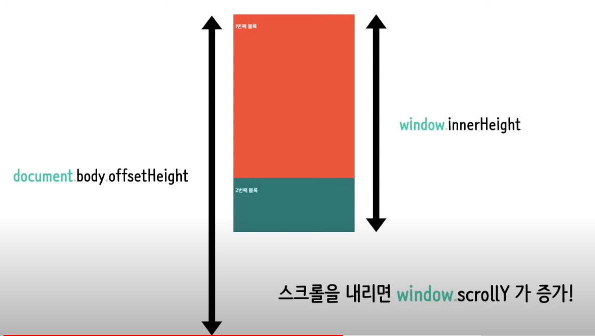
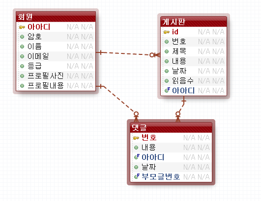

# ServerBasic
## 복습용 README.md
> 리드미 한 페이지로 수업내용요약 및 복습, 정리 + 개인적인 공부로 추가적인 내용도 붙을 수 있음 > 이해를 기반한 내용임

## 1. 서블렛(Servlet)
- 웹서버측에서 자바를 사용한 프로그램을 동작시키는 기술(환경)이다. 
- 목적) 클라이언트의 요청에 따른 동적 웹페이지 생성을 위함
- HTML, CSS, JavaScript로 만든 정적페이지와는 다르게 동적 페이지는 요청이 들어올 때마다 적합한 페이지를 그 즉시 만들어 준다. 

> 정적 페이지는 공산품 캔커피, 동적 페이지는 알바생이 만들어주는 것


## 2. Servlet Class(서블릿 클래스)
- 자바클래스다.
- 서블릿이 알바생이다. 
- 정의된 틀이 있고 이것대로 우리가 구현하면 된다. 
1. 서블릿 클래스 선언 
   * javax.servlet.Servlet 인터페이스를 구현(복잡)
   * javax.servlet.http.HttpServlet 클래스를 상속(이 방법이 무난하다.)
   * > HttpServlet가 Servlet인터페이스로 구현

   * 작성법 > 기본적으로 service코드를 작성해야 한다. doGet, doPost
   * 매개변수 2개 
     * 1. java.servlet.http.HttpServletRequest
     * 2. java.servlet.http.HttpServletResponse
   * 예외미루기
     * 1. java.io.IOException    // 페이지를 동적으로 생성 > 외부 입출력 
     * 2. javax.servlet.ServletException; // 서블릿 작업 때문에
  
## 3. 서블릿작성 
``` java
public class Ex02 extends HttpServlet {
    public void doGet(HttpServletRequest request,
                HttpServletResponse response) throws IOException, ServletException{
                    
                    response.setCharacterEncoding("UTF-8"); // 브라우저에 보이는 인코딩 설정(이거는 meta 태그도 같이 해줘야 한다. )
			              PrintWriter writer = response.getWriter();

                    writer.println("<html>");
                    ... 
                    writer.println("</html>");

                    writer.close();
                }
}

```
* ★ 서블릿에서 브라우저로 직접 출력해줄 때 response.setCharacterEncoding("UTF-8"); 이 필요, 근데 이것만 해서는 안된다. 
* ★ html 형식으로 response로 writer를 꺼내서 print를 해주는 경우에는 브라우저는 meta태그 charset='UTF-8'를 인식해야 한글을 제대로 표기할 수 있다. 
### ★서블릿에서 브라우저로 직접 출력시
* writer.write("<head><meta charset='UTF-8'></head>"); 이부분을 꼭 넣어주거나 
* resp.setContentType("text/html;charset=utf-8");를 써야 한다.
* 택 1해라 
* 그래야 브라우저에서 한글이 제대로 뜬다. 


## 4. 서블릿 작성 예시 + 추가
- 서블릿은 아래의 메서드를 오버라이드하여 작성할 수 있다.
- doGet은 Get요청만, doPost는 Post요청만 가능하다.
- init은 서블릿이 처음 요청될 때 초기화를 하는 메서드
- service는 서블릿 컨테이너가 요청을 받고 응답을 내려줄 때 필요한 서블릿의 service메서드 > doGet, doPost이런거다.
- destory는 더 이상 사용되지 않는 서블릿 클래스는 주기적으로 서블릿 컨테이너가 destory 메서드를 호출해서 제거 
```java
public class myServlet extends HttpServlet {

    @Override
    public void init(ServletConfig config) throws ServletException {
        System.out.println("init method 호출!");
    }
    
    @Override
    public void destroy() {
        System.out.println("destroy method 호출!");
    }
    
    @Override
    protected void doGet(HttpServletRequest request, HttpServletResponse response)
        throws ServletException, IOException
    {
        System.out.println("doGet service method 호출!");		
    }
    
    @Override
    protected void doPost(HttpServletRequest request, HttpServletResponse response)
        throws ServletException, IOException
    {
        System.out.println("doPost service method 호출!");		
    }
	
}
```

## 5. web.xml
```xml
다음과 같이 web.xml 파일에 > 자바 파일(서블릿, 알바생)을 호출할 수 있는 가상주소를 맵핑한다.
    <servlet> //서블릿 클래스를 서블릿으로 등록
           <servlet-name>ex03</servlet-name> //해당 서블릿을 참조할 때 사용할 이름
           <servlet-class>com.test.servlet.Ex03</servlet-class> //서블릿으로 사용할 서블릿 클래스의 FullName
     </servlet>
     <!--
         위 서블릿을 등록, url 패턴을 지정해준다.
         동작되는 url은 contextRoot 밑으로 동작된다. 
      -->
     <servlet-mapping>
           <servlet-name>ex03</servlet-name> //매핑할 서블릿의 이름
           <url-pattern>/ex03</url-pattern> //매핑할 URL 패턴
     </servlet-mapping>
```

## 6. 서블릿 동작흐름 


먼저 우리가 톰켓이라는 걸 실행시켜놓는다. 그 후에 Ex03.java 코드를 작성하고 web.xml파일 작성하고 컴파일해놓아서 메모리에 올려놓는다. 그 후 브라우저는 http//컨텍스트루트/ex03로 요청을 보내면 톰켓 서버는 web.xml을 뒤진다. 맞는 URL패턴에 클래스를 실행시켜주려고 하는 것이다. 그래서 맞는 것을 실행시켜주는 것이다. Ex03은 doGet()를 작성했다. 서블릿 컨테이너는 서블릿 인스턴스를 생성하고 doGet()을 호출시켜 doGet()에서 만드는 임시페이지를 서버 톰켓으로 전송한다. 톰켓은 HTTP response로 클라이언트쪽으로 전송하는데 이 페이지를 우리는 캐싱해놓고 캐싱해놓은 페이지를 브라우저는 우리에게 보여준다.
* 또다른 특징 : java의 스레드 사용, MVC 패턴이용 등

* 만약 다시 동일 페이지 호출시 : 재컴파일을 하지 않고 서블릿이 호출

* 소스가 바뀌면 서블릿을 재 컴파일
* 자바쪽 소스가 많다. > 이게 메인임 클라이언트쪽 소스 다루기가 빡쌔다...

## 7 . JSP. Java Server Page
- 자바를 사용해서 서버측에서 페이지를 만드는 기술, Servlet의 다음 버전
- Servlet vs JSP
  - Servlet은 자바코드에서 시작, 자바 베이스 코드 작성 관리가 용이한데 Html 코드를 문자열 취급해서 넣어줘서 클라이언트 코드쪽 작성이 불편하다. 그리고 web.xml에 가상주소 매핑이 필요하다. 
  - JSP는 HTML 코드쪽에서 시작한다. 클라이언트 코드 작성이 쉽다. web.xml 가상주소 매핑이 필요없다. webapp에 .jsp파일을 작성하고 URL을 그쪽으로 쏴주면 된다. 
  - 코드 작성 영역상의 차이가 조금 있고 기술적인 개념은 비슷한점이 많다. 
- JSP + Servlet을 섞어서 쓸 수 있다.
  - 서블릿 : 자바 코드 담당
  - JSP : 클라이언트 코드 담당
  - 너무 한쪽만 쓰면 코드관리도 어렵고 유지 보수가 어려우니 둘이 떼어놔서 각각 좀더 편한쪽에서 쓰는 것이라 생각함

## 8. JSP 구성요소 
- JSP 지시자, JSP Directive
  - page 지시자, include 지시자, taglib 지시자
  - <%@ page language="java" contentType="text/html; charset=UTF-8" pageEncoding="UTF-8"%> 
  - language="java" : 현재 페이지를 처리하는 서버측 언어가 java
  - contentType="text/html; charset=UTF-8" : 브라우저에게 돌려줄 임시 페이지에 관련된 설정, 니가 받아볼 페이지는 utf-8, html
  - pageEncoding="UTF-8" : ★ 현재 JSP 페이지의 인코딩
  - 이것들 utf-8 설정안하면 글자깨지니까 조심하기
  - <%@page import = "java.util.*" %>

- 스크립트 요소, Scripting Elements
  - 스크립틀릿 <%     %>  Scriptlet > : 맨위쪽에 쓰는 경우는 자바프로세싱 관련 코드를 구현할 때고 태그 사이에 중간 중간 for문을 돌리기 위해 넣기도 한다. 
  - 익스프래션 <%= 값 %>  Expression 해당 위치에서 값을 출력하는 용도이다. 
- 선언부 : 스크립틀릿이나 익스프래션은 잘쓰는데 이건 잘 안쓴다. 
  - <%! %> :꺽쇠느낌표이다. 스크립틀릿 안에서는 메서드가 안만들어진다. 그리고 스크립틀릿 안에선 지역변수가 만들어짐, 변수 셋팅은 가능한데...
  - 근데 선언부 쪽은 메서드가 만들어진다. 근데 이게 현재 페이지에서만 유효함 
  - 선언부는 전역변수 선언이나, 메서드 정의 목적으로 사용하나 어차피 메서드는 라이브러리 가져다 쓰니까 import 쓸거고 해서 크게 필요성이 떨어진다.
  - 스크립틀릿에서 만들어진 변수는 지역변수인데 이것은 요청에 따른 _jspService()와 생명주기를 같이하고 선언부의 전역변수는 객체 생성, 소멸과 생명주기를 같이한다. ex) 두 변수를 증감연산으로 새로고침했을 때 전역변수는 계속 증가될거고 지역변수는 요청단위라 그대로다.

## 9. JSP 내장 객체 > JSP Implicit Object
- 개발자가 직접 생성하는 객체가 아니라, JSP(톰켓)이 미리 만들어서 제공하는 객체이다.
- JSP>변환>java파일>컴파일>class파일>서블릿객체가 페이지생성>톰켓이 받아서 브라우저쪽으로 전달
- Run on server하는 순간 jsp가 변환된 java파일은 class파일과 함께 .metadata>plugins>org.ecplise.wst.server.core>tmp0>work>Catalina>localhost>jsp>org>apache>jsp 이쪽에 들어온다. > 이쪽 java파일에서 정의된 것이 기본객체다.!


- 기본 객체 종류 request, response, session, pageContext,out, application, config, page, exception 등.. 
  
- pageContect, request, session, application 
  - 데이터 저장하는 목적으로 사용한다. map같은 느낌으로 쓴다. 
  - 내장객체.setAttribute(key, value);
  - 내장객체.setAttribute(key);
  - map으로도 전달이 가능하다. 배열도 전달가능, 시간도 전달가능, "a,b,c,d"와 같이 csv 형식으로도 전달이 가능하다.
  - 이 4가지는 범위개념을 가진다. 'Scope'
  
1. request > 클라이언트쪽에서 url로 뭔가 보냄
   * 전송된 데이터를 가져올 때 사용, ( get이나 post로 전송되는 데이터 꺼낼 때 )
   * A페이지에서 B페이지로 데이터가 옴 그러면 해당 B페이지에 request 객체에서는 getParameter로 데이터를 꺼내볼 수 있다.
   * 근데 이게 데이터 인코딩을 셋팅을 안하면 데이터가 깨져나올 수 있으니 받는 페이지에서 getParameter 하기전에 인코딩을 잘 설정하자.
   * 전송된 데이터 인코딩 request.setCharacterEncoding("UTF-8");
   * 요청 관련 정보도 얻어올 수 있다. 요청한 사람의 ip나 method나, 프로토콜이나 기타 등등 요청헤더정보 꺼내보는 메서드가 있음
   * request.getContextPath() 등~ 
  ``` java
  	<% Enumeration<String> e= request.getHeaderNames();
			while(e.hasMoreElements()){
				String name = e.nextElement(); //nextElement()로 다음거 꺼낸다.
		%>
		<tr>
			<td><%= name %></td>
			<td><%= request.getHeader(name)%></td>
		</tr>
		<%
			}
		%>
  ```
2. response > 서버>(행동)>클라이언트
   * response는 서블릿에서 브라우저로 보여줄 페이지를 만드는과정에서 getWriter()호출하고 호출하는 페이지의 인코딩 셋팅을 했었다. 
   * jsp단에서는 response.sendRedirect("ex11_response_two.jsp"); 이렇게 자바코드에서 리다이렉트 코드를 작성할 수 있다. 
   * 그리고 돌려줄 내용의 MIME을 지정한다. 이건 파일 업로드 과정에서 다룬다.
3. pageContext
   * 페이지 실행(요청~응답) 중에 관련된 데이터를 저장하는 객체인데
   * 페이지내에서만 유요한 객체임 그래서 pageContext
   * pageContext.forward()라는 메서드를 forward하기 위해 쓴다. 

4. out
   * out이라는 객체는 출력용도이다. 서블릿에서 response의 PrintWriter와 비슷한 역할이다. jspWriter로 만든 것임. 스크립틀릿 중간중간에 넣어쓸래? 아니면 한방에 쓸래?의 차이이다. 딱히 필요성은 못느끼겠음 아직까진??

``` java
    <h1>구구단</h1>
	<%
		int dan = 5;
	%>
	
	<h2>out 사용 안함 </h2>
	<% for ( int i=1 ; i<=9 ; i++) { %>
	
	<div><%= dan %>  x <%= i %> = <%= dan * i %></div>
	
	<% } %>
	
	<h2>out 사용함 > 우리에게 선택권을 주는 것이다. </h2>
	<% for ( int i=1; i <=9 ; i++ ) { 
		out.println(String.format("<div> %d x %d = %d </div>",
				dan,
				i,
				dan*i)); 
                // 서블릿이 하던 방식이다. 출력용도인데 기본객체니까 import 필요 없네 
	}
	%>
```
5. session(개별)
   * 전역변수 > 접속 종료전까지 계속 유지, 한번 만들어놓으면 사이트 전체에서 이용가능
   * session.getId() : 세션 식별자
   * session.isNew() : 세션이 방금 만들어졌나?
   * long tick = session.getCreationTime(); : 세션 생성시간 tick값이라 Date 객체로 시간 따로 처리해야함
   * session.setAttribute("d", 40);      : session에 "d"라는 key로 40저장
   * session.getAttribute("d")           : "d"라는 key로 값 꺼냄
   * session.setMaxInactiveInterval(30); : 만료시간 셋팅 > 사이트에 따라 만료시간 설정은 다를 수 있다. 
   * session.invalidate();               : 세션을 초기화. 로그아웃할 때 쓴다고 함, 그럼 removeAttribute는?
   * session.removeAttribute("data");    : 해당 키의 어떤 세션값을 지운다.
   * > 서버에서 만들어진다.  이거 인증이런데에다가 유저 id 넣고 하는데 쓰긴한다. 근데 유저가 한 두명이 아니다. 유저 10000명 세션 자체도 한정된 공간이고 메모리? 꽉차면 서버 다운될 수 도 있음 > 조심해서 써야함 > 서버가 클라이언트마다 개별적으로 부여
6. application(공용) > 얘도 데이터를 저장하진 않음 설정파일, 기타 db설정등 저장하는 용도로 쓴다. 
   * 세션과 성질은 비슷한데 큰 차이가 있음 여기는 공용 공간임 A유저, B유저가 같은 application에 저장된 데이터를 볼 수 있다.
   * 얘도 만료기간이 있다. 서버에 사용자가 들어올 때마다 만료기간 초기화 가능한데 가끔 사람이 몇시간 동안 안오면 이값이 사라지는 것.


> 쿠키는 Java Servlet단에서든, Javascript단에서든 조작이 가능함
7. Cookie(쿠키)
   * 개인 정보를 저장하는 저장소
   * 브라우저가 관리하는 저장소이다.
   * 서버 부담이 없다. 
   * 서블릿, 자바 단에서든, javascript 클라이언트 단에서든 쿠키를 조작할 수 있다.
   * 쿠키 종류 
     * 메모리쿠키(session cookie)
       * 메모리에 저장되고, 디스크엔 저장이 안됨
       * 브라우저가 실행중에만 저장
       * 브라우저가 종료되면 쿠키도 삭제
       * 은행 사이트 같은 경우엔 아이디를 기억하면 안됨 
       * Expires/ Max-Age부분이 Session이면 Session쿠키
     * 하드쿠키(persistent cookie)
       * 브라우저가 종료되도 유지
       * 하드디스크에 저장
       * Expires/ Max-Age부분이 특정한 기간이 기록
       * w3school cookie 예제 > javascript로 쿠키 저장
```js 
function setCookie(cname, cvalue, exdays) {
  const d = new Date();
  d.setTime(d.getTime() + (exdays * 24 * 60 * 60 * 1000));
  let expires = "expires="+d.toUTCString();
  document.cookie = cname + "=" + cvalue + ";" + expires + ";path=/";
} // cookie는 key value로 내용을 저장하는 것 

function getCookie(cname) {
  let name = cname + "=";
  let ca = document.cookie.split(';');
  for(let i = 0; i < ca.length; i++) { 
    let c = ca[i];
    while (c.charAt(0) == ' ') { // trim 하고 value 리턴
      c = c.substring(1);
    }
    if (c.indexOf(name) == 0) {
      return c.substring(name.length, c.length);
    }
  }
  return "";
}
```
  * 쿠키의 삭제 (위의 javascript 코드 기준)
 ``` js
 // 이 방식으로 쿠키를 삭제하는 법은 따로 없다.
setCookie('id', null, -1); 로 value를 null 넣고 시간 -1로 셋팅해야 한다.
 ```
  * 자바코드에서 쿠키를 생성하기 
``` java
// 자바 코드에선 
Cookie cookie = new Cookie("color", "blue");
response.addCookie(cookie);            // 이렇게 쿠키를 저장한다. > response에서 저장

Cookie[] list = request.getCookies();  // 쿠키를 확인하려면 > request 객체에서 확인

for(Cookie c : list){ // 객체를 기반으로 한 쿠키도 역시 key, value였다.
		System.out.println(c.getName() +","+ c.getValue());
}
```
https://m.blog.naver.com/pjok1122/221726178384 : 여기 사이트 좋은 정보 많음

> DB 작업 시
> * DB를 사용하려면 ojdbc6.jar 파일을 참조할 수 있도록 원래는 build path를 지정해야 한다. 근데 따로 지정할 필요 없이 WEB-INF/lib/ 밑에다가 .jar파일을 저장하면 된다. 
> * 1번 방식 > 미리 sql가지고 statement 셋팅 후 setString으로 ?에 인자를 넣는다. 
>   * PreparedStatement pstat = null;
>   * this.conn = DBUtil.open();
>   * ? 넣어서 sql 작성 ,
>   * pstat = conn.prepareStatement(sql);
>   * pstat.setString(1, dto.getMemo());
>   * stat.executeUpdate();
>   * int result = stat.executeUpdate();
> * 2번 방식 ( 나중 )
>   * Statement stat = null;
>   * ?없는 Sql작성 사이사이 str 넣음;
>   * stat = conn.createStatement()
>   * rs = stat.executeQuery(sql); // !!나중에 sql을 넣는다. executeQuery가 받는다. 
> * executeUpdate : insert, update, delete > int 값을 받는다. 영향받은 row 개수
> * executeQuery  : select > ResultSet을 받아준다. 1개여도 여러개여도 가능

## ★ redirect 와 forward 개념
* Redirect > 고객, 상담원의 개념
  * 고객에 상담원에게 전화를 123번으로 함 
  * 상담원은 고객에게 해당 문의사항은 124번이라고 다시 전화하라고 함
  * 클라이언트의 요청 2번, 받은 응답 2번
  * 실질적으로 요청을 2번을 보내다보니까 만약에 처음 request에 값을 넣어보냈다면 두번째 보낼 때는 그 값이 사라진다.
  * 결과적으로 redirect된 url로 변함, 왜냐면 요청을 두번보냈으니까 두번째 보낸 요청으로 변하게 된 것임
  * CRUD 쪽에서 사용되는데 게시판 글 입력폼에서 입력ok폼으로 post 전송을 함, 입력ok폼에서 게시판 목록으로 redirect를 쏴주면 게시판 목록에선 request 내용이 없다. 이걸 유지하려면 쿼리스트링으로 또 직접 넣어줘야함
  * redirect는 항상 get요청!!
  
* Forward > 고객, 상담원의 개념
  * 고객에 상담원에게 전화를 123번으로 함 
  * 해당 상담원은 문의사항의 내용을 잘 몰라서 옆의 다른 상담원을 직접 연결함
  * 그 다른 상담원이 문의사항을 처리해줌
  * 실질적인 클라이언트의 요청은 한번이다. 고객의 전달사항(request)은 고대로 다른 상담원에게 감
  * 결과적으로 처음보냈던 url 그대로 
  * 결과적으로는 클라이언트는 다른 상담원이 준 응답을 받았는데 본인이 요청을 또 할필요가 없으니 url이 그대로 인 것
  * ★ request내에 저장된걸 들고가야할 때 사용한다. 
 

## ★ 아래의 주소록, 로그인, 로그아웃 특징은 form에서 action 처리를 .jsp 파일 쪽으로 처리한다. 이게 전형적인 Model 1방식이다. 

## 10. 주소록 CRUD
1. 업무 > 생략 
2. DB작업 > ERD(X) > 테이블 생성
3. 클라이언트 작업 > 레이아웃 + 페이지 구현 > HTML, CSS, Javascript 
	* webapp > "address" 폴더 생성
  	* > "list.jsp"    목록보기 
    	* DB에서 정보를 가져와서 목록 보여준다. Connection, Statement(), ResultSet, select seq 기준 내림차순 쿼리
    	* while(rs.next()) 반복문, rs.getString("key") 해서 중간에 html 태그 안에 넣는다.
    	* 수정, 삭제에 대한 처리를 위해서 수정, 삭제 링크 url에 쿼리스트링으로 seq를 붙여논다. 
  	* > "add.jsp"     추가하기(폼)
    	* 더미값으로 추가할 정보 input에 채움 (function() {})(); 이건 즉시호출
    	* form, input태그, addok.jsp쪽으로 action, body에 내용 채워져서 addok.jsp로 내용물 간다.
  	* > "addok.jsp"   추가하기(처리) 
    	* request.getParameter()하기 전에는 request.setCharacterEncoding("UTF-8"); 설정
    	* request.getParameter()로 꺼낸 정보를 insert sql, executeUpdate
  	* > "edit.jsp"    수정하기(폼)
    	* 이전 페이지에서 쿼리스트링으로 받은 seq를 가지고 DB에서 정보 조회
    	* 입력 폼 내용을 채워서 editok.jsp로 POST로 전송
  	* > "editok.jsp"  수정하기(처리)
    	* update 쿼리, setString은 내가 정의해주는 데이터의 타입이지 DB에서 정의한 타입은 아니다.
    	* 쿼리 result에 따라서 alert 띄우고 location.href로 redirect 
  	* > "del.jsp"     삭제하기(폼)
    	* edit과 비슷 
  	* > "delok.jsp"   삭제하기(처리)
    	* edit과 비슷
  	* > "template.jsp" 임시페이지
    	* 틀이다. 이거 복붙해서 새 페이지 작성
					
	* webapp  > address > "inc" 폴더 생성
		* > "header.jsp"
  		* 네베게이션 이런거 상단 메뉴, 다른코드 없이 '건더기' 코드만 붙인다. 잡다한 코드 제거
		* > "asset.jsp"
  		* link 코드, script 불러오기 등
		* > JSP에서 <%@ page language="java" contentType="text/html; charset=UTF-8"
		* > 불러오기 할 때 커스텀 style이나 js 코드는 cdn 아래쪽에 넣기
    pageEncoding="UTF-8"%> 는 페이지마다 붙여야 한다.
 	* webapp > address > "asset" 폴더 생성
 		* > "main.css"


## 11. 웹 보안 > 로그인, 로그아웃
* 인증, Authentication
  * 현재 접속자가 해당 사이트의 구성원인지 확인
  * 회원?이면 로그인해라

* 허가, Authorization
  * 권한을 가지고 있는지 확인한다. > 뒷구멍 url 접속(막아야함!)

* webapp > "auth" 폴더 생성
    * "index.jsp"     : 시작 페이지(초기화면)
      * <%= > 표현식에 값 안넣으면 에러나서 이걸 if(session.getAttribute("id") == null) 처리한다.
      * 정보가 있으면 session.getAttribute로 출력
    * "login.jsp"     : 로그인 폼 페이지 
      * POST 방식 전송
    * "loginok.jsp"   : 로그인 처리 페이지 > 인증 작업 
      * DB 쿼리 코드 > select로 id, pw로 쿼리 날려서 가져온 id, pw와 폼에서 입력한 id, pw가 일치하면 session에 id, name, lv를 저장
    * "logout.jsp"    : 로그아웃 페이지       
      * session.removeAttribute는 해당 key값에 대한 value를 제거
      * session.invalidate로 초기화 할 수도 있는데 이러면 아예 세션을 초기화라 모든 key, value 없앰
      * 제거 후에는 response.sendRedirect("index.jsp"); 
    * "member.jsp"    : 회원 전용 페이지 > 허가 작업 
      * 유저는 http://localhost:8090/jsp/auth/member.jsp URL을 알아낼 수 있다. 
      * 정상적이지 않은 통로로 접속이 가능한데 이걸 막으려면 
      * if(session.getAttribute("id") == null) 조건 걸어서 null이면 out.println()에 내용채워서
      * alert과 동시에 location.href로 redirect를 쏴준다. 
    * "admin.jsp"     : 관리자 전용 페이지 > 허가 작업
      * 위에다 lv 추가해서 조건달면 됨
      

## 12. Servlet + JSP > JSP Model2  

> JSP Model
1. JSP Model1(이전에 했던 것)
	- HTML + CSS + Javascript + JAVA + Servlet + JSP = *.jsp
	-> 다 한 페이지에 한방에 떄려넣는데 Model 1이다. 
	- 코드가 뒤엉켜서 > 불편하다. 실무 코드는 코드량이 매우 많다.
	
2. JSP Model2
	- Servlet : 자바 코드 작성	
	- JSP : 클라이언트 코드 작성
	- 디자인 패턴 : MVC 패턴 기반 구현
	- Model(dao쪽이나, db 작업코드), Controller(서블릿코드), View(JSP) 역할이 분명함
3. 기본적인 JSP 모델 2 
``` java
// 왜 .do가 붙을까? doGet이런 패턴을 따서 do를 붙였다고 함
// 애너테이션 등록시 xml에 가상주소를 안써도 된다.  
// 스프링도 이런 방식이 있다. 
@WebServlet("/hello.do") 
public class Hello extends HttpServlet{

	@Override
	protected void doGet(HttpServletRequest req, HttpServletResponse resp) throws ServletException, IOException { // controller

         // model code
         int count = 10;
         req.setAttribute("count", count);

         RequestDispatcher dispatcher = req.getRequestDispatcher("/WEB-INF/mvc/hello.jsp"); dispatcher.forward(req, resp); // view 단 호출
    	}  
  }
  // servlet 코드 내에서 resp.sendRedirect( req.getContextPath()+"/mvc/hello.jsp"); 이런식으로도 해당 view 파일을 호출할 수 있으나 url이 바뀌어서 나온다. 그리고 redirect로 jsp 파일명을 넣는 것은 사실 옳지 않다. 
  // dispatcher.forward를 써주면 "/hello.do"로 호출했지만 호출해준 쪽은 url 변경을 모르기에 url 변경이 되지 않고 jsp 파일을 보여준다. 
```
  4. 톰켓 서버를 올리고 url로 접속하면 webapp아래에 jsp파일 자원을 찾는다. 하지만 이렇게 jsp파일을 webapp로 넣는다면 해당 url로 가면 코드가 노출될 우려가 있다. 그래서 대외비 view 파일 저장용으로는 WEB-INF폴더를 사용한다. 여기에 view파일을 저장한다.
   
## 13. JSP Model 2 + EL +JSTL 

* com.test.mvc > "Address.java" : Controller
	* "AddressDAO.java" : Model(?)이라 쓰기에도 애매하긴하다.
  	* dao객체는 controller 단에서 dao객체 method 호출을 한다. 근데 여기서 return을 ResultSet으로 쌩으로 써버리면 컨트롤러 짜는 사람이 DB쪽 코드를 알아야 한다. 제대로 코드책임의 분리가 안된 것! 
  	* 그래서 return을 ArrayList<AddressVO>와 같이 좀더 제네럴한 느낌으로 바꿔준다. 여기선 controller단에서 쓰기 편하게 하는 약간의 인터페이스 역할?이라고도 본다.
	* "AddressVO.java"  : Model
			   
* webapp > mvc > "address.jsp" : View
  * 이쪽에서 el을 찍어본다. 
  
## EL!! 
* 실무에선 코드가 매우매우매우 많다. <% %>, <%= %> 스크립틀릿, 익스프래션의 남발보다는 뭔가 깔끔함을 지향하는 것이 필요했음 
* 그게 EL(Expression Language)인데 자바의 값을 HTML 문서에 출력하는 역할을 한다. 
* 기본적으로는 내장 객체(pageContext, request, session, application)안에 있는 데이터를 출력한다. 
* 대충 아래 코드의 느낌이라고 보면 된다.
``` html
<!-- 서버단에서 "count"의 key로 value를 보내줬다고 가정함 -->
<div>
	 	<div>주소록 총 인원수 : <%= request.getAttribute("count") %></div>
	 	<div>주소록 총 인원수 > EL버전 : ${ request.getAttribute("count") }:이건 안댐</div>
	 	<div>주소록 총 인원수 > EL버전 : ${ count }:이건가능 key값을 찾아서 값으로 변환</div>
	 	<div>주소록 총 인원수 > EL버전 : ${ count*2 }</div>
</div>
```
* <%= request.getAttribute("count") %> 이건 스크립틀릿으로 쓴건데 이렇게 쓴걸 ${ count } 이 방식으로 쓴다. 즉 "key을 적어주면 알아서 value를 찾아서 매핑시켜 주겠다는 말" 그래서 ${ request.getAttribute("count") } 이렇게 쓰는건 안된다. > 코드량이 줄고 심플해짐
* 더 좋은점은 ${ }안에서 연산이 가능하다. 스크립틀릿은 타입을 신경써야했다. 연산을 하려면 기존 String 타입에서 int로 바꾸고 연산을 했다. <%= (int)request.getAttribute("count")*2 %>

* 위에서 내장 객체(pageContext, request, session, application)안에 있는 데이터를 출력한다고 했는데 그러면 값을 어떻게 찾는가? 
* 생명주기가 작은애부터 찾는다. pageContext > request > session > application
* pageContext, request, session, application 네 군데 동시에 동일한 키로 값이 있어도 pageContext에 있는 값을 ${ } EL로 뽑아낸다.

``` js

<!-- 리터럴 표현 -->
<div>${100}      : 100</div>
<div>${3.14}     : 3.14</div>
<div>${"홍길동"} : 홍길동 </div>
<div>${'홍길동'} : 홍길동 </div>
<div>${true}     : true </div>
<div>${null}     :  null은 공백</div>

<!-- 배열 -->
<div>${nums}    : 객체주소값</div>
<div>${nums[0]} : 배열 안의 값 하나</div>

<!-- List는 get 사용가능하다. nums2[0] -->
<div>${nums2} : toString형태로 출력 > [1, 2, 3,]</div>
<div>${nums2.get(0)}</div>
<div>${nums2[0]}</div>

<!-- Map index 지원한다. get 사용가능, nums3["kor"], nums3.kor -->
<div>${nums3} : { } 형태로 출력 </div>
<div>${nums3.get("kor")}</div>
<div>${nums3["kor"]}</div>
<div>${nums3.kor}</div>

<!-- Object --> // getter, "key"접근, .key접근
<div>${vo} : com.test.mvc.AddressVO@aa2cf9a </div>

<!-- get변수 > 변수 앞 대문자가 소문자로 바뀌어서 key로 됨 -->
<div>${vo.getName()} : get변수 > 변수 앞 대문자가 소문자로 바뀌어서 key로 됨</div>
<div>${vo["name"]} : vo[key] 이런식으로도 접근이 가능하다. </div>
<div>${vo.name} </div>


<div>a + b = ${a} + ${b} : \${ }를 띄어서 쓰면 문자열로 취급되어 붙음 </div>
<div> 그래서 \${ } 안에서 연산을 해야 한다. </div>
<div>a + b = ${a + b}</div>
<div>a + b = ${a - b}</div>
<div>a + b = ${a * b}</div>
<div>a + b = ${a / b}</div>
<div>a + b = ${a div b}</div>
<div>a + b = ${a % b}</div>
<div>a + b = ${a mod b}</div>

// ★★ 앞에것 기준이다.! 
<div>${a > b}</div>
<div>${a gt b}</div>
<hr>
<div>${a >= b}</div>
<div>${a ge b}</div>
<hr>
<div>${a < b}</div>
<div>${a lt b}</div>
<hr>
<div>${a <= b}</div>
<div>${a le b}</div>
<hr>
<div>${a == b}</div>
<div>${a eq b}</div>
<hr>
<div>${a != b}</div>
<div>${a ne b}</div>

<div>${a > 10 && b <5 }</div>
<div>${a > 10 and b <5 }</div>
<div>${a > 10 || b <5 }</div>
<div>${a > 10 or b <5 }</div>
<div>${!( a > 10 ) }</div>
<div>${not( a > 10 ) }</div>

// 삼항 연산자 
<div>${ a > 0 ? "양수":"음수"}</div>

<%
// 생명주기가 작은애부터 찾는다. 그래서 
// pageContext > request > session > application
pageContext.setAttribute("age", 21);
request.setAttribute("age", 32);
session.setAttribute("age", 33);
application.setAttribute("age", 34);
%>

<div>나이: ${age}</div> // pageContext꺼다. 


//★ scope라는 개념이 있음 기본객체에 저장한 

<div>나이: ${pageScope.age}</div>
<div>나이: ${requestScope.age}</div>
<div>나이: ${sessionScope.age}</div>
<div>나이: ${applicationScope.age}</div>

```

### JSTL. JSP Standard Tag Library 
- 자바 서버페이지 표준 태그 라이브러리 
- 프로그래밍 기능이 있는 태그 모음
- 아래것이 찍히면 우리는 jstl이 잘 설치한것
- 상단에 아래의 부분을 추가한다. 긴 uri를 prefix라는 키워드로 별명을 붙이고 사용할 때 c:머머, fmt:머머 이렇게해서 사용한다.
- <%@ taglib prefix="c" uri="http://java.sun.com/jsp/jstl/core" %>
- <%@ taglib prefix="fmt" uri="http://java.sun.com/jsp/jstl/fmt" %>


### <c:out>은 값을 출력하는 용도의 명령어 
``` js
<!--  값을 출력하는 명령 -->
<c:out value="안녕하세요"></c:out>
<c:out value="${count}"></c:out>
<c:out value="${count2}"> 값이 없음: count2에는 값을 넣지 않음 이럴 때 PCDATA 값을 출력한다. </c:out>
```


### <c:set>은 var이라는 이름으로 변수를 지정한다. scope를 통해서 어디에 저장할 지 지정도 가능하다. 
```
<c:set var="n1" value="100" scope="page"></c:set>
<c:set var="n1" value="100" scope="request"></c:set>
<c:set var="n1" value="100" scope="session"></c:set>
<c:set var="n1" value="100" scope="application"></c:set>
${n1}  // 사용시 이렇게 사용 

↓ 아래와 같이 어느 scope 있나 확인 가능

<div>${pageScope.n1}</div>
<div>${requestScope.n1}</div>
<div>${sessionScope.n1}</div>
<div>${applicationScope.n1}</div>

// 변수는 수정이 가능하다. 
<c:set var="age" value="11"></c:set>
<c:set var="age" value="22"></c:set>
<div>${age}</div>


// 변수 삭제 set으로 만든 것은 remove로 처리가 가능하다. -->
<c:remove var="age"/>
<div>age : ${empty age}</div>

```
### 조건문1 // else if를 제공하지 않음
```
<c:if test="${num > 0}">
  <div>${num}은 양수입니다.</div>	
</c:if>
<c:if test="${num <= 0}">
  <div>${num}은 양수가 아닙니다.</div>	
</c:if>
```

### 조건문2 // 다중 조건문(choose - when)
```
<c:choose>
  <c:when test="${num > 0}">양수</c:when>
  <c:when test="${num < 0}">음수</c:when>
  <c:when test="${num == 0}">영</c:when>
  <c:otherwise>기본값</c:otherwise>
</c:choose>
```

### 반복문(for문, 향상된 for문) 
* items는 배열받고, var이나 varStatus
```
<c:forEach var="name" items="${names}" >
  <div>${name}</div>	
</c:forEach>
	
<c:forEach var="i" begin="1" end="5" step="1">
  <div>${i}</div>
</c:forEach>
				<!-- 인덱스가 1부터 시작이다.  -->
				<!--  중간 인덱싱이 가능하다. -->
<c:forEach items="${names}" var="name" begin="2" end="4">
  <div>${name}</div>
</c:forEach>
	
<c:forEach items="${names}" var="name" varStatus="status" >
  <div>${status.count}. arr[${status.index}] = ${name}, status.first = ${status.first}, status.last = ${status.last}</div>
</c:forEach>
	
<c:forEach items="${colors}" var="name">
  <div>${name}</div>
</c:forEach>
```
### forTokens > delims로 파싱한다. 
### items로 "${colors}"나 "${names}" 받음
```
            <!--  "빨강,노랑,파랑:검정,초록" >> 짜른다. , delims로  -->
<c:forTokens items="${colors}" delims=":" var="name">
  <div>${name}</div>
</c:forTokens>
```

### 링크처리 > 쿼리스트링 붙일 수 있다. 

``` js

// 보통 c:param의 PCDATA 쪽 내용은 안채운다. 

<c:url var="link" value="http://localhost:8090/view.do">
		<c:param name="name" value="hong"/>
		<c:param name="age"  value="20"/>
		<c:param name="address" value="서울시강남구"/>
</c:url> // 이부분은 페이지에서 보이지 않고 아래에서 var로 link를 참조할 때 보인다. 이렇게해서 서버로 보내면 req.getParameter()로 받음
↓

<a href="http://localhost:8090/view.do?name=hong&age=20&address=%ec%84%9c%ec%9a%b8%ec%8b%9c%ea%b0%95%eb%82%a8%ea%b5%ac">링크</a>
```

### 다음과 같이 redirect 처리도 가능하다.
```
<!-- response.SendRedirect(URL)로 변환 -->
<%-- <c:redirect url="https://naver.com"></c:redirect>  --%>
```

### fmt > 시간표기, %, $, 소수점표기, ','표기 등을 할 수도 있다.
```js
// value부분이 pattern에 맞춰서 출력이 된다.
<div>내 생일 <fmt:formatDate value="${birthday}" pattern="yyyy-MM-dd E a HH:mm:ss"/></div>
<c:set var="price" value="10000" />
<div>가격: ${price}원</div>
<div>가격: <fmt:formatNumber value="${price}" />원</div>

// 이렇게 new java.util.Date() 객체를 받고, 변수지정해서 이걸로 시간표기도 가능하다.
<c:set var="now" value="<%=new java.util.Date()%>"></c:set>
```

## 14. 파일 업로드 / 다운로드

- 클라이언트 > (복사) > 서버  : 업로드
- 서버 > (복사) > 클라이언트 : 다운로드
- 파일 업로드 라이브러리로 cos.jar라는 라이브러리가 있는데 굉장히 오래됬지만 아직도 쓴다고 함
- 파일 업로드는 POST 메서드로 구현한다.
- 핵심은 enctype 부분에서 갈린다. 
- 우리가 기본적으로 입력을 하고 form태그로 데이터를 전송할 때는 enctype이 "application/x-www-form-urlencoded" 기본타입이다. > 요거 때문에 쿼리스트링 형태로 전달이 가능, 모든 문자를 서버로 보내기 전에 인코딩  
- enctype="multipart/form-data" 일때 모든 문자를 인코딩하지 않음, 파일이나 이미지를 서버로 전송시 사용한다. request.getParameter() 값이 null이 나온다.\<input type="file">이 포함된 form에서 쓴다. 
- request.getParameter() 값이 null이 나오는 해결책으로 cos라이브러리를 쓰고 MultipartRequest라는 객체를 사용해서 전송된 내용을 꺼낸다.
- \<form method="POST" action="서블릿" enctype="multipart/form-data"> 이런식으로 form태그를 구성
- multipart/form-data 사용시 다중 업로드도 가능하다. 
``` java
// 객체 초기화
MultipartRequest multi = new MultipartRequest(
req,    // 기존에 쓰던 request 객체
req.getRealPath("/uploads"), // 서버 컴터에 파일이 저장될 위치
1024 * 1024 * 100,            // 허용 사이즈
"UTF-8",                       
new DefaultFileRenamePolicy()); // 얘가 이름 바꾸는 일 한다.
```
- 기존에 쓰던 request객체, 서버 컴퓨터에 파일이 저장될 위치, 허용 사이즈, 인코딩 방식, 중복 처리 방침 등의 설정을 한다.

- MultipartRequest의 메서드
  * getParameterNames()
  * getParameterValues()
  * getParameter()
  * getFileNames()        : 파일을 여러개 업로드할 경우 타입이 file인 파라미터 이름들을 Enumberation 타입으로 반환
  * getFilesystemName()   : 서버에 실제로 업로드된 파일 이름 반환
  * getOriginalFileName() : 클라이언트가 업로드한 파일의 원본 이름 반환
  * getContentType()      : 업로드된 파일 이름의 마임 타입 반환
  * getFile()             : 서버에 업로드된 파일의 객체 자체를 반환

- 파일에 대한 location 정보를 다룰 때 
  - ★ 파일의 전체 경로를 다루지 않는다. 왜냐면 로컬 -> 서버 컴퓨터 이런식으로 개발하는 환경이 바뀔 수 있는 것이고 이러한 파일이 저장된 경로를 노출하는 것 자체가 보안적인 문제가 있으므로 location을 다룰 때 파일명으로 다룬다. 그러한 파일명 앞에 경로를 붙이는 것은 서버코드 몫이다. 클라이언트 쪽으로는 노출시키지 않는 것이 원칙이다.

- ☞ 파일 업로드 동작 flow > ( ★ 반드시 POST, file업로드하는 jsp파일에서 submit을 한 후 )
  - MultipartRequest 객체 생성 
  - 파일 저장방법
    - MultipartRequest 생성자에 우리가 지정해준 위치로 파일이 저장된다. 
    - 우리는 서버에 중복된 파일이 저장되어 관리될 수 있도록 가짜이름을 부여해서 서버에 저장한다. 
    - 실제이름은 multi.getOriginalFileName("attach") 이것
    - 서버에 저장되는 파일이름 multi.getFilesystemName("attach"); 이것
    - \<input type="file" name="attach"> 이부분에서 name을 지정한대로 정보를 받아온다. 
  - MultipartRequest 객체로 getParameter()로 전송된 데이터를 꺼낸다. 
- ☞ 파일 다운로드 동작 > ★ GET방식 ~ !
  - link에 href 속성으로 다운로드를 처리하는 주소를 달아놓는다. 쿼리 스트링으로 원본파일 이름, 가자이름을 같이 달아준다. 
  - 해당 링크를 클릭하면 download를 처리하는 서블릿으로 이동
  - 다운로드 동작원리 
    - 서버에 파일이 저장된 위치를 찾는다. jsp단에서 원본이름, 서버에 저장된 파일이름 정보를 받았으니 이걸 활용해서 파일의 절대경로를 구함 
    - 서버에 파일 절대 경로 가지고 FileInputStream 스트림을 열고 이걸 읽어서 response.getOutputStream()을 호출해서 ServletOutputStream객체를 가지고 write를 해준다. 
    - 읽을 때는 한번에 큰 파일을 못읽으니까 while문으로 청크단위로 읽는다. 
    - flush로 버퍼내용 비워주고 스트림 close() 
    - 그리고 중간 중간에는 header 세팅, 그리고 항상 인코딩 신경써야 한다. 
      - ContentType 설정도 해주긴 해야함
      - Content-Disposition 이부분도 설정해주는데 없으면 에러가 날까? 
```java
//1. 저장될 위치 지정 (webapp폴더에 uploads라는 폴더를 미리 만들고 시작)
String savePath = "uploads";
ServletContext context = getServletContext(); // 톰켓 context를 가지고와서 
String sDownloadPath = context.getRealPath(savePath); //진짜로 서버의 getRealPath인데
String sFilePath = sDownloadPath + "/" + fileName; // 진짜로 파일이 저장된 path

//2. header 셋팅
String sMimeType = getServletContext().getMimeType(sFilePath);
if (sMimeType == null) // 내려받기로만 처리하기 위해서 
    sMimeType = "application/octet-stream"; 	  
response.setContentType(sMimeType);    
// agent.indexOf 라는 코드로 브라우저 식별 코드를 짜는 경우 
String agent = request.getHeader("User-Agent");
boolean ieBrowser = (agent.indexOf("MSIE") > -1) || (agent.indexOf("Trident") > -1);
if (ieBrowser) {
    fileName = URLEncoder.encode(fileName, "UTF-8").replaceAll("/+", "%20");
} else {
    fileName = new String(fileName.getBytes("UTF-8"), "iso-8859-1"); // 사이사이 인코딩이 들어간다. 
}
orgfileName = new String(orgfileName.getBytes("UTF-8"), "ISO-8859-1");// 사이사이 인코딩이 들어간다.
response.setHeader("Content-Disposition", "attachment; filename= " + orgfileName); 

// 3. 파일 복사 코드
FileInputStream in = new FileInputStream(sFilePath); // 파일을 여는 스트림 지정
ServletOutputStream out2 = response.getOutputStream();
int numRead;
byte b[] = new byte[4096];
while ((numRead = in.read(b, 0, b.length)) != -1) { // 파일을 이만큼 읽어서 쓴다. 
    out2.write(b, 0, numRead);                       // OutputStream에 write 해준다. 
}
out2.flush(); // 버퍼에 남은 내용이 있으면 모두 파일에 출력 
out2.close();
in.close();
```
* 기본적으로 톰켓은 url에 특문을 입력하면  tomcat rfc 7230 rfc 3986 오류를 띄운다.
* 특문을 해석하지 못함 > 첫번째 해결법 톰켓 server.xml 손보기
  
* 혹은 view단에서 const uri = 'https://mozilla.org/?x=шеллы';
const encoded = encodeURI(uri); 이렇게 URI인코딩을 해야함


## DownloadPath 처리
- 기본적으로 링크를 상대경로로 표시하면 contextRoot에 상대경로가 붙는다.
- 하지만 다운로드시에는 contextRoot를 인지하지 못하고 컨텍스트루트/file/download.do를 해야 다운로드 서블릿이 동작이 되는 문제가 있었음.
- 그래서 그냥 c:url 처리를 했다. 이러면 알아서 상대경로를 붙여주니 해당 문제가 일어나지 않는다. \<a href="<c:url value='상대경로'/>" >


### 다중파일 업로드 
- multipart/form-data 쓰는 거 동일하고 \<input type="file" name="attach1"> 부분 신경쓰고
``` js
// jsp단.
<input type="file" name="attach1">
<input type="file" name="attach2">
<input type="file" name="attach3">
<input type="file" name="attach4">
// ↑ 여기서 name값을 중복시키지 않도록 조심하자! 

// servlet단 > 처리 
Enumeration e = multi.getFileNames(); 
List<String> olist = new ArrayList<String>();
List<String> flist = new ArrayList<String>();
while(e.hasMoreElements()){
  String name = e.nextElement().toString();	// attach1, attach2, attach3, attach4					
  String orgfilename = multi.getOriginalFileName(name);
  String filename = multi.getFilesystemName(name);
  // System.out.println(">"+orgfilename);
  // System.out.println(">"+filename);
  olist.add(orgfilename);
  flist.add(filename);	
}
req.setAttribute("olist", olist);
req.setAttribute("flist", flist);
```
- getFileNames를 쓰면 input type=file된 것의 name 속성의 여러값을 저장한다. multipart/form-data가 다중 업로드를 지원하니 파일이름, 원본파일이름만 리스트로 관리면 된다. 


## 15. 이미지 뷰어(갤러리) > 파일업로드 + DB 연동
- CRUD에서 C, U는 input에 정보를 담아서 form POST로 submit을 한다. 
- POST 서블릿을 작성한다.
- 그런데 R, D는 해당 정보를 구별할 수 있는 id나 seq만 필요하다보니 link?seq=10 이런식올 링크전송으로도 문제를 해결한다. redirect나 링크전송 자체는 GET방식
- 서블릿(Controller)역할, DB작업 DAO에게 위임, 마지막줄에는 view를 호출하는 코드
- com.test.file 
  - "List.java" // 시작 페이지
	- "Add.java"
	- "AddOk.java"
	- "View.java"
	- "FileDAO.java"
	- "FileDTO.java"
	- "Edit.java"
	- "EditOk.java"
	- "DelOk.java"

- 서블릿단> 처리> 결과를 dto 형태로 request에 넣고 view단으로 전송 
- view단에서는 EL로 ${dto.name} 이렇게 값을 꺼내서 쓴다. 
- 리스트뷰 > 뷰 > 수정페이지뷰 > 수정이라는 동작을 하기위해선 seq가 필요하다. seq 자체를 뷰페이지에선 보여주진 않음 그래서 input type="hidden" value="${dto.seq}"로 가지고만 있는다. 수정 form 제출시 수정 서블릿에서는 seq를 가지고 수정작업에서 수정될 게시물을 처리한다.

- views >
  - "list.jsp"
  - "add.jsp"
  - "addok.jsp"
  - "view.jsp"
  - "edit.jsp"
  - "editok.jsp"
  - "delok.jsp"


### 첨부파일 > 데이터베이스 관리
- 배포환경은 다르다. 프로퍼티 파일로 파일의 저장경로를 저장
- html 내에서 파일을 찾는 경로와 db에서 파일을 찾는 경로는 다르다. 
- 두 가지 경우가 있따. 
- 1.파일을 직접 DB에 저장하는 경우 > 바이너리 저장방식 > 느림...
  - 그럼 티스토리 같은 블로그에 이미지를 글 안에 올리는 것은??
    - 별도의 업로드처리를 따로 가지는 경우
    - 이미지를 직렬화해서 문자열로 넣는 방법 > 이미지가 너무 길어진다.
- 2.파일은 (별도)하드에 저장, DB에는 파일명만 저장 > 이걸 주로 사용함 
  - 실제 실무시에 서버에 NAS를 실제 디렉토리처럼 사용할 수 있도록 '마운트' 할 수 있다. 

### VO vs DTO 
* 둘다 데이터를 저장하는 객체이지만 의미를 구분해서 사용하는 경우가 많음 
- VO : Value Object > 특정 값 자체를 표현한다.  > Read Only > 불변성
  - DB에서 가져온 데이터를 보관
  - 읽기 전용 > 리터럴(상수)
  - 고치면 안됨 수정하는 순간 VO가 아니다. > setter를 정의하지 않음 
  - 값자체의 불변성을 위해서 생성자를 쓴다. 한번 정의하고 안고치겠다는 말 
  - 서로 다른 이름을 갖는 VO인스턴스라도 모든 속성 값이 같다면 두 인스턴스는 같은 객체라고 할수 있음
  - compare 기능에서 사용하는 경우엔 equal, hashcode정도는 정의해도되고 ToString도 정의해도 좋음
- DTO : Data Transfer Object > 수정가능 
  - setter, getter 외의 다른 노직이 필요 없음 데이터 전달용도 
  - 두 객체의 필드 값이 같더라도 두 객체는 다른 객체다. 
  - 계층간에 데이터를 전송할 때 사용되는 도구(택배상자)
  - 컨트롤러라는 계층이 뷰에게 보낼 때 택배상자(택배 상자)
  - 하나의 계층에서 또다른 계층에서 전송할 떄만든 클래스인데 한 눈에 알아보기 쉽게 이름을 붙임  

- DTO가 조금더 사용하기엔 제네럴하긴하다.

### 동적으로 요소추가 
- 댓글 방식도 이방식으로 구현이 되는데 버튼에 click이벤트를 걸고 jquery의 append()를 사용하고 요소 추가


### 성공 or 실패시 처리
- 이전 서블릿 단에서  result와 다시 돌아갈 곳의 힌트가 되는 정보를 넘겨준다. 
- 아예 DAO를 jsp단에서 import하여 성공실패 처리도 가능하다.
  


### jstl > 테이블에 요소배치
- 만약에 테이블의 한 row에 5개씩 배치하려고 한다. 
  - 그럼 5개가 되는 순간에 tr을 닫고 다시 열어야 한다. 
- 근데 공간이 남는다. 이것을 처리해야하려면 5 - list.size()%5 로 남는 공간 처리


## 16. Memo 
### 조금 다른 설계를 한다. 클래스 단위로 뷰 보여주는 클래스, 처리전용 클래스로 작업을 했었는데
### 이제는 Method 단위로 함 (Add.java, AddOk.java 이렇게 분할하지 않음)
### Category, Memo 1:1 관계 테이블 다룸 > Category, Memo를 포괄하는 큰 클래스를 더 둘 수가 있는데, 굳이 안둬도 아래처럼 서브쿼리로 한쪽 테이블로 받아버린다. 
"com.test.memo"
- "List.java" // 목록 
  - String sql = "select tblMemo.*, (select icon from tblCategory where seq = tblMemo.cseq) as icon, (select color from tblCategory where seq = tblMemo.cseq) as color  from tblMemo order by seq desc";
  - 두개의 1:1 테이블에서의 값을 꺼내는데 컬럼단 서브쿼리 사용
- "Add.java"   // 글쓰기
  - doGet, doPost가 있다. 
  - doGet의 용도는 페이지를 보여주는데 데이터와 함께 보여줄 수 있다.
  - doPost는 데이터를 body쪽에 담아온걸 처리 
  - 서블릿 단으로 가서 아예 페이지를 forward나 redirect를 안하고 그냥 writer.writer.write("\<script>alert('failed'); history.back();</script>"); 스크립트를 write해버리는 경우도 있다. 이렇게 주면 alert창 뜨고, 뒤로 가는게 된다. 
  - 
- "Edit.java"  // 수정하기
- "Del.java"   // 삭제하기
  - 삭제시 redirect하는 코드가 있다. doGET 구현인데 Post냐, GET이냐는 크게 의미적으로는 중요하지 않음, 여기선 GET이 편함
  - 성공시 resp.sendRedirect("/memo/list.do"); 실패시 writer.writer.write("\<script>alert('failed'); history.back();</script>"); 
  - 
- "MemoDAO.java"
- "MemoDTO.java"
- "CategoryDTO.java"
// > CategoryDAO는 안만든다. 
 
// ok페이지를 안만들어도 된다. 
- webapp > WEB-INF>"views"
  - list.jsp
    - style 속성도 ${dto.color} 이런식으로 DB에 있는 정보로 지정
    - \<span class="material-symbols-outlined">${dto.icon}</span> 구글 아이콘 같은거는 PCDATA 부분만 가져다가 쓰면 모양이 나오기 때문에 저부분을 DB에 넣어도 된다. 
    - \<span onclick = "del(${dto.seq});">[d]</span>
  - add.jsp
  - edit.jsp
    - list페이지 > edit페이지 여기서 한쪽 선택! > edit.java 근데 뭘 바꾸는가? seq를 list에서 받고 edit에선 hidden으로 가지고 있는다. 
  - del.jsp
    - 크게 의미 없다. 
  - views > inc
    - asset.jsp
    - header.jsp

## 17. Ajax
## Ajax > 비동기다. 동기면 큰일..
- ex01
  - resp.sendRedirect("/ajax/ex01.do?count="+count); 리다이렉트 때 쿼리스트링 붙여
- ex02 
  - ResearchDTO 부분
    - DTO를 어떻게 구성하느냐는 유연하게 할 수 있다. 
    - 여러개의 String을 가진 String[]로 DTO를 구성할 수 있다. 
    - String[] item = { rs.getString("item1"), rs.getString("item2"), rs.getString("item3"), rs.getString("item4") };
    - 이경우엔 item1, item2, item3 이렇게 각각 내용을 적었다. 
    - setTimeout(function() {location.reload();}, 5000); 5초마다 새로고침한다. ajax가 아닌 이방법도 일종의 방법이기도 하다. 
- ex03
  - 한 페이지에서 리로딩을 계속함 근데 문제점은 현재 작업하는 input이 있으면 그것도 날라감... 
  - iframe 방법 > 페이지 안에 프레임을 넣는다.
  - src속성으로 다른 jsp파일 혹은 url로 iframe으로 정의를 한다. 
  - 이 방법은 ajax이전의 방법이다. 
  - iframe으로 창을 띄움 거기서 변경점을 만들고 자신을 호출한 부모 jsp파일에 반영
  - top.document는 해당 문서의 최상위문서인데 이 예제에선 iframe을 호출한 쪽의 문서를 조작하기 위해 씀
  - 여기 iframe은 reload되어도 부모 페이지엔 영향을 안준다.
  - 우편주소 입력창 같은걸 이런걸로 옛날에 많이 구현함
- ex04
  - const ajax = new XMLHttpRequest(); 라는 게 있다.
  - 나이브한 ajax임 옛날버전!...
  - ajax.onreadystatechange = function()  이렇게 이벤트를 정의한다. 콜백이벤트임
  - ajax.open으로 GET이든 POST이든 요청을 한다.
  - ajax.send() 이건 실제 연결이다. 전송 버튼을 누른 효과
  - ajax.readyState ajax의 객체 상태를 나타내는데
    - 4개의 값이 있음 4라고 찍히면 서버로부터 안전하게 받음
  -  ajax.status = 200 상태값 
  -  if(ajax.readyState == 4 && ajax.status == 200) 요렇게 확인
``` js

// GET 요청일 땐 send에 내용 안채움, 쿼리 스트링으론 붙일 수 있다. 
ajax.open('GET', '/ajax/ex05data.do?txt2=' + $('#txt2').val()); // 
ajax.send(); 

// POST 요청일 때 send안에 내용을 채워넣는다. 일종의 바디임
ajax.open('POST', '/ajax/ex05data.do'); 
ajax.setRequestHeader('Content-Type', 
          'application/x-www-form-urlencoded');
ajax.send('txt2='+$('#txt2').val());

// ★ application/x-www-form-urlencoded : 이게 form태그의 default encoded type이다. 

```
### JSON 규격만들기
* 네트워크상에서는 String형태로 json format이 돌아다닌다. 근데 규격엔 맞아야 한다.
* 키, 값을 쌍따옴표로 표기한다. 자바단에서 키값 쌍따옴표로 표기할 때 "는 escape를 시켜줘야 한다.
* 이 부분을 주의하자 
``` java
	
     JSON > https://jsonformatter.curiousconcept.com 여기서 검증처리
     - ★ 배열 그 자체도 json이 될 수 있다. 대신 쌍따옴표만 붙여줘...
     - ★ Json 안에 배열도 OK
     - ★ 키와 값을 쌍따옴표로 표기한다. 
     - ★ 메소드는 표시 불가
      {
      "키" : "값",
      "키" : "값"
      }
      [
      [10, 20 , 30]
      {
        "키" : "값",
        "키" : "값"
      },
      {
        "키" : "값",
        "키" : "값"
      }
      ]
      {
      "question": "질문"
      }
```
### ajax 사용처
* 특정 이벤트 발생시 서버에서 값을 가져오려고 할 때, 혹은 서버로 값을 보내어 검증을 하려고 할 때 ajax를 사용한다. 

### tuddse
* 이게 가장 무난한 형태이다. 
* 아래의 예제는 GET으로 보내고, data에 type=6이라는 쿼리스트링을 붙여줌 
* async : true, // 비동기(true), 동기(false)로 설정가능한데 웬만해선 비동기 그래서 이거 건들 일이 없다.(ex06)
```js
	$('#btn3').click(()=>{
		$.ajax({
			type: 'GET',               // 요청 method
			url : '/ajax/ex07data.do', // 요청되는 url 
			data:'type=6',             // 보내는 데이터
			dataType:'json',           // 받을 데이터의 타입
			success : (result)=>{ // 성공적으로 수신하였을 때 받는 데이터를 가지고 하는 함수처리
				// result = {"question":"가장 자신 있는 프로그래밍 언어는?"}
        // result로 받는데 result가 json이야, $( )는 만능이네?
				$(result).each((index, item)=>{
					$('#div3').append(
						`
							<div>\${item.name}</div>
						`
					); //SyntaxError: Unexpected token ']', ..."대문구 회기동"},]" is not valid JSON 콤마껴놓은거도 에러임 이거 json validator 형식맞게 하자
				});
			},
			error: (a, b, c) => console.log(a, b, c)
		});
	});
```


## ex07은 여러 타입별 ajax
## 받는 데이터 타입 
* text, xml, json이다. 
* text로 서버에서 보내주는 경우 > resp.setContentType("text/plain"); 설정
  * csv나 걍 값 
* xml로 서버에서 보내주는 경우 > resp.setContentType("text/xml"); 
  * 간단하게 특정태그의 값을 찾는 경우
  * 어떤 item 태그 안에 각각 seq태그, name태그, age태그, address태그 안에 값이 들어있음
    * 아이템 리스트를 전송하는 경우
* json으로 서버에서 보내주는 경우 > resp.setContentType("application/json");
  * { "result" : "1" }
  * [{ },{},{},{} ] 이런 경우도 있고
``` js 
writer.print("<?xml version='1.0' encoding='UTF-8' ?>");
writer.printf("<question id='q1'>%s</question>", dto.getQuestion());
// 받는 데이터 타입을 xml로 설정, $( ) 제이쿼리로 받고 find를 사용해서 태그를 찾는다. id 기준이던지 뭘로 암튼 찾는다. 
	$.ajax({
			type:'GET',
			url : '/ajax/ex07data.do',
			data: 'type=3',
			dataType : 'xml', // 서버가 Ajax에게 돌려주는 데이터 형식 같이 선언해야 한다.
			// (text, xml, json)
			success : (result) => { // $('#div1').text(result)
				//$('#div2').text(result) //[object XMLDocument]
				$('#div2').text($(result).find('question').text()); //태그로 찾던지
				//$('#div2').text($(result).find('#q1').text());//id로 찾던지 
			},
			error : (a, b, c) => console.log(a, b, c)
		}); 
```
``` js
	String temp="";
		temp+="[";
		
		for(AddressDTO dto : list) {
			temp += "{";
			temp +=String.format("\"seq\" : \"%s\",", dto.getSeq());
			temp +=String.format("\"name\":\"%s\",", dto.getName());
			temp +=String.format("\"age\":%s,", dto.getAge());
			temp +=String.format("\"tel\":\"%s\",", dto.getTel());
			temp +=String.format("\"address\":\"%s\"", dto.getAddress());
			temp +="}";
			temp +=",";// 환경에 따라서 에러가 나는 경우가 있고 안나는 경우가 있다. 
		}
		temp = temp.substring(0, temp.length()-1); // 마지막 콤마제거 코드
		temp+="]";
    // 서버쪽에서 저렇게 보낸걸 아래에서 받음
    // 배열도 json 형식임
    // jquery에 담아서 each로 돌림
    $.ajax({
			type: 'GET',
			url : '/ajax/ex07data.do',
			data:'type=6',
			dataType:'json',
			success : (result)=>{
				// result = {"question":"가장 자신 있는 프로그래밍 언어는?"}
				// alert(result.question);
				$(result).each((index, item)=>{
					$('#div3').append(
						`
							<div>\${item.name}</div>
						`
					); 
				});
			},
			error: (a, b, c) => console.log(a, b, c)
		});

```


### ex08.jsp  > ID 중복검사 예제
* 버튼을 누르면 id 중복검사 창이 뜸 
``` js
$('#btn1').click(()=>{
		window.open('/ajax/ex08check.do', 'idcheck', 'width=350 height=350');
}); 
// WEB-INF에 jsp파일이 있어서 서버단을 경유해야 한다. 
// idcheck 이름부여, width height 셋팅
// 1. 창을 띄움으로서 페이지 새로고침 없이 다른창에서 중복처리 로직을 한다. > 창에서는 자신을 호출한 쪽으로 opener.document.getElementById('id1').value = '${id}'; 이렇게 해서 태그 내용 변경 가능
// result 값에 따라 btn의 disable 설정가능
// $('#btn1').attr('disabled', true);

// 2. ajax 방식으로 하면 창을 띄우지 않고 바로 페이지에서 중복여부만 받아와서 출력해주면 된다. 
```
### ex09
* 우편주소 검색 > db에 있는거 검색해서 가져오기 
``` js
// 버튼 클릭스 id = address1 이 있는 태그의 html내용 제거
// 그 안에 내용을 option으로 채운다. 
	$('#btn1').click(()=>{
		$('#address1').html('');
		$.ajax({
				type: 'GET',
				url : '/ajax/ex09data.do',
				data: 'dong='+$('#dong').val(),
				dataType : 'json',
				success: (result) => {
					$(result).each((index, item) => {
						$('#address1').append(
						`
							<option value=''>\${item}</option>
						`		
						);
					});
				},
				error: (a, b, c) => console.log(a, b, c)
		});
	});
```

### ex10 
* form 전송과 ajax
  * form 태그를 아래처럼 submit을 할 수 있다. 
  * form 태그가 submit을 하면 action으로 등록된 위치로 동작하거나 없으면 자기 자신으로 새로고침한다.
* ★ 이러한 새로고침을 막으려면 event.preventDefault();, return false; 사용한다.
* 객체형태, 쿼리스트링형태는 data로 들어가서 서버에서 getParameter로 받을 수 있지만 json stringify는 그렇게 받을 수 없다.
``` js

//서블릿에서 받는 형태
String txt1 = req.getParameter("txt1");
String txt2 = req.getParameter("txt2");
String txt3 = req.getParameter("txt3");
String txt4 = req.getParameter("txt4");
String txt5 = req.getParameter("txt5");

//★ 보내는 데이터 형태 
// > 객체 형태
const obj = { // 이건 굉장히 체계적이고 이걸 전송할 수 있도록 지원을 해준다.  > req.getParameter()로 받음
		txt1 : $('#txt1').val(),
		txt2 : $('#txt2').val(),
		txt3 : $('#txt3').val(),
		txt4 : $('#txt4').val(),
		txt5 : $('#txt5').val()
	}; 
// > 쿼리 스트링 형태 > req.getParameter()로 받음
let data = 'txt1=' + $('#txt1').val()
    + '&txt2=' + $('#txt2').val()
    + '&txt3=' + $('#txt3').val()
    + '&txt4=' + $('#txt4').val()
    + '&txt5=' + $('#txt5').val();

// json 모양비슷하게 Stringify 시킨 형태 > req.getParameter()로 못받음 > 사실 json규격에 안맞음
// 자바단 library에는 이걸 ' 때문에 인식못함
let jsonlikeStr = "{'txt1' : '딸기', txt2 : '바나나','txt3' : '포도'}"; // 

$('#form1').submit(( ) => {
		$.ajax({
			type:'GET',
			url: '/ajax/exdata.do',
			data: obj, // 이렇게 넣으면 된다. 심플
			//data : jsonlikeStr, // 이거 안됨
      //data : data, //이것도 된다! 
			success: (result) => {},
			error: (a, b, c)=>console.log(a,b,c)
		});
		event.preventDefault(); // 
		return false;           // 
	});

// $('#form1').serialize()를 사용하면 한방에 다 보낼 수 있다. > req.getParameter()로 받음
$('#form1').submit(()=>{
	  //	alert($('#form1').serialize()); // 여기서 alert창에선 퍼센트 인코딩 되어 있다. 
    // 서버단에서는 getParameter로는 제대로 들어온다.
    // 보내는 방법 3
		// 이거 쓰면 한방에 다 들어간다. 
		// ★ 반드시 name 속성이 있어야 한다. name에 있는것들 직렬화한다는 방법
		$.ajax({
			type:'GET',
			url:'/ajax/ex10data.do',
			data: $('#form1').serialize(), // 편하다.
			success: (result) => {},
			error : (a, b, c) => console.log(a, b, c)
		})
	});

//  list를 data로 보내는 형태 > 객체느낌으로 보낸다. 그리고 ★ traditional: true라는 옵션을 켜야한다.
// 이런 경우는 getParameter로 받긴하는데 받는 방법이 살~짝 다르다. list라는 키에 배열을 담아서 그렇다. 
$('#form1').submit(()=>{
  //<input type="checkbox" name="aaa">
  const list = ['사과', '바나나', '딸기', '포도', '귤'];
  $.ajax({
    type:'GET',
    url:'/ajax/ex10data.do',
    traditional: true, // ★ 요렇게 한쌍> 이것이 ajax 배열 넘기기 옵션 
    data: {            // ★ 리스트를 담는 객체 정의
      list:list
    }, // 편하다.
    success: (result) => {},
    error : (a, b, c) => console.log(a, b, c)
    
  })
});

// 서블릿 단에서는 아래와 같이 받는다.
// list라는 이름으로 Values를 찾는 방식 
String[] list = req.getParameterValues("list");
// getParameterValues는 String[]로 리턴해준다. 
for(String item : list) {
  System.out.println(item);
}


// 주의 해야 할점은 key, value 감쌀 때 홑따옴표 붙이면 안된다. 절대안댐...
// json화를 해야할 때 객체를 만들고 JSON.stringify를 사용
// 혹은 간단한 json을 보낼 땐 "{ \"key\":\"value\"  }" : 작업을 해주자 
$('#form1').submit(( ) => {
		alert(JSON.stringify("{'txt1' : '딸기', 'txt2' : '바나나', 'txt3' :'포도', 'txt4':'배', 'txt5':'멜론' }")); // 이렇게 한다고 JSON String 규격에 맞춰지진 않음
		$.ajax({
			type:'POST',
			url: '/ajax/ex10data.do',
			contentType: 'application/json',
			//data : JSON.stringify(obj),// ★ 객체를 stringify해서 json문자열화는 가능
			//data : "{\"txt1\" : \"딸기\", \"txt2\" : \"바나나\", \"txt3\" :\"포도\", \"txt4\":\"배\", \"txt5\":\"멜론\" }",  // ★ json문자열화 규격으로 정의하여 직접 보내줌 > 이건 가능하다.
			//data : "{'txt1' : '딸기', 'txt2' : '바나나', 'txt3' :'포도', 'txt4':'배', 'txt5':'멜론' }", // json String ★ 이거 안된다.
			// data: JSON.stringify("{'txt1' : '딸기', 'txt2' : '바나나', 'txt3' :'포도', 'txt4':'배', 'txt5':'멜론' }"), // ★이거도 안된다.
			dataType: 'json',
			success: (result) => {},
			error: (a, b, c)=>console.log(a,b,c)
		});
		event.preventDefault();
		return false; 
	});  
  // jackson-databind
  // json-simple 이거 두개 라이브러리 써야 한다. 


    // ★ JSONParser가 parse를 하고 객체화된 json obj를 반환하는 구조 
    // 위의 json을 아래 JAVA단에서는 JSONParser.parse(String s); 이걸로 파싱해서 JSONObject로 돌려주고 get으로 해당 키값을 접근한다.
    // ★ JSONObject는 get, put정도만 일단은 알면 된다.

    //자바에서는 파일입출력할떄 이렇게 썼었다.
    //BufferedReader reader = new BufferedReader(new FileReader("파일경로"));

    // 웹에서는 Stream을 받아와야 한다. InputStreamReader객체 안에다가 req.getInputStream()을 연결
    // BufferedReader가 데이터를 받아올 준비가 됨
	  BufferedReader reader = new BufferedReader(new InputStreamReader(req.getInputStream()));
		String line = null;
		String temp ;
		while((temp = reader.readLine()) != null) { // 이거 while 떄문에 line이 null
			System.out.println(temp); 
			line = temp;
		}
		reader.close(); 		// 문자열 형태로 받는다.
		JSONParser parser = new JSONParser();
		try {
	
			JSONObject obj = (JSONObject)parser.parse(line); // object로 받아서 다운캐스팅
			System.out.println(obj.get("txt1"));  
			System.out.println(obj.get("txt2"));
			System.out.println(obj.get("txt3"));
			System.out.println(obj.get("txt4"));
			System.out.println(obj.get("txt5"));
			//JSONObject 인데 이거 결과값으로 보내줄 때 writer.print(obj);로 보내주면 된다.
		} catch (ParseException e) {
			e.printStackTrace();
		}

    // ★ 자바단에서 DTO값을 JSON으로 보내주는 예제1)
    // JSONObject에 put으로 key, value를 채워서 보내준다.
    AjaxDAO dao = new AjaxDAO();
		ResearchDTO dto = dao.getResearch(1);
		JSONObject obj= new JSONObject();
		
		obj.put("question", dto.getQuestion());
		obj.put("seq", dto.getSeq());
		//System.out.println(obj.toString());
		
		resp.setCharacterEncoding("UTF-8");
		resp.setContentType("application/json");
		
		PrintWriter writer;
		System.out.println(obj); // toString 그럼 toString을 json으로 정의하면 되는거 아님?
		writer = resp.getWriter();
		writer.print(obj);
		writer.close();
		
    // ★ 자바단에서 DTO값의 List를 JSON으로 보내주는 예제2)
    // JSONObject에 put으로 key, value를 채우고, JSONArray로 add해서 보내준다.
    AjaxDAO dao = new AjaxDAO();
		List<AddressDTO> list = dao.listAddress();
		JSONArray arr = new JSONArray();
		for(AddressDTO dto : list) {
			JSONObject obj = new JSONObject();
			obj.put("name", dto.getName());
			obj.put("age", dto.getAge());
			obj.put("address", dto.getAddress());
			arr.add(obj);
		}
		resp.setCharacterEncoding("UTF-8");
		resp.setContentType("application/json");
		PrintWriter writer;
		writer = resp.getWriter();
		writer.print(arr);
		writer.close();

  // ★ 마무리로 writer.print로 JSONObject를 넣어줄 수 있고, JSONArray를 넣어줄 수 있다.

  $('#btn2').click(()=>{
		$.ajax({
			type: 'GET',
			url : '/ajax/ex10data.do',
			
			dataType: 'json',
			success: (result) => {
        // ◎ 하나만 받던지> 하나받으면 바로 result.seq로 접근
				//$('#result').append('<div>' + result.seq+ '</div>');
				//$('#result').append('<div>' + result.question+ '</div>');
        // ◎ 여러개를 받으면 jquery안에 넣어서 item으로 꺼냄 리스트라서 item은 json상태임
				$(result).each((index, item) =>{
					$("#result").append('<div>'+ item.name + '</div>');
					$("#result").append('<div>'+ item.age + '</div>');
					$("#result").append('<div>'+ item.address + '</div>');
					$("#result").append('<hr>');
				});
			},
			error: (a, b, c) => console.log(a, b, c)
		});
	});

```

## ex11
* table의 td태그에는 CellIndex라는 속성이 제공된다.
* tr은? 어떻게 구할 까? parentElement로 한번 올라가서 rowIndex 속성을 사용
* $(this).css('background-color')는 rgb문자열값을 반환
* $(this).css('background-color', 'transparent'); 라고 지정하면 하얀색으로 배경댐
```js
$('#tbl1 td').click(function(){
let x = this.cellIndex; // 
let y = this.parentElement.rowIndex; 
});
```

## ex12 
* ★★ 클로저의 사용 매우 중요하다.
* 이벤트 함수에서 또 이벤트 함수로 들어간 경우 두번째 이벤트함수에서 첫번째 이벤트 함수의 this를 사용하고 싶을 때 쓴다. ( 화살표함수에선 this 안되고 event.target )
``` js

$('.line').each((index, item)=>{  
  // item은 DOM이다. 그래서 $()에 넣어서 제이쿼리 객체 만듬
  // jquery 객체는 index()라는 함수제공 
		console.log($(item).index()); // 0, 1, 2, 3, 4 쭈욱 출력
});


// 이벤트를 겹겹이 쓰는 경우 
// 키 다운을 하고 5초가 지나면 수정한 내용을 저장 안내 메세지가 보인다.
$('.line').keydown(function(){
		clearTimeout(timer);
		let temp = this;
		timer = setTimeout(function() {

			let seq  = $(temp).index()+1;
			let line = $(temp).val(); // 얘는 클로저가 된다.
			$.ajax({
				type : 'POST',
				url : '/ajax/ex12data.do',
				data : {
					seq : $(temp).index() + 1,
					line: line
				},
				error : (a, b, c) => console.log(a, b, c)
			});
			
			// 안내 메세지
			$('#message').css('display', 'flex');
      
			setTimeout(function() {
				$('#message').css('display', 'none');
			}, 500);
			
		}, 5000); // 5초 후 임시저장
	});

  // 글을 입력하고 해당 대상에 포커스를 잃으면 자동저장된다.
  // blur() : 대상이 포커스를 잃었을 때 이벤트를 처리하는 이벤트 핸들러 
	$('.line').blur(function(){
let seq = $(this).index()+1;
		let line = $(this).val(); // 얘는 클로저가 된다.
		$.ajax({
			type : 'POST',
			url : '/ajax/ex12data.do',
			data : {
				seq : $(event.target).index() + 1,
				line: line
			},
			error : (a, b, c) => console.log(a, b, c)
		});
  });
```
## ex13
* 서버처리, 뷰단에 내용도 동기화 처리
* 글 + 파일첨부 
* 수정, 삭제 버튼
  * 수정을 누르면 확인, 취소버튼이 뜬다.
  * 확인 취소 버튼은 display:none인데 수정을 누르는 순간 나타난다.
  * div로 버튼 두개 묶음 그걸 수정 누르면 확인, 취소가 뜨도록하고
  * 확인 누르면 다시 div로 묶은 수정, 삭제 버튼이 복구 
* const formData = new FormData(document.getElementById('form1')) 
* 1. 통으로 넘기기
* 2. 아래 옵션 지키기
  * processData: false
  * contentType: false
  * enctype: 'multipart/form-data'
* 3. 서블릿단에서 MultipartRequest 사용하기
``` js
// 상품을 등록, 그리고 방금 등록한 상품을 result로 쏴준다. 
$('#btn').click( ()=>{
		// 일반 텍스트 + 첨부 파일 > Ajax 통해서 전송  
		const formData = new FormData(document.getElementById('form1'));
		$.ajax({ // 새로고침없이 파일첨부
			type: 'POST',
			url: '/ajax/ex13add.do',
			enctype: 'multipart/form-data',
			processData: false,
			contentType: false,
			data : formData, // 이러면 form이 담긴 데이터를 전송한다.// ★ toLocaleString은 parseInt로 바꾸고 해야한다. 
			dataType:'json',
			success : (result)=> {
				if(result.result == 1) {
					// 여기서 아래 ${} 이건 변수에 대한 값을 받으려고 쓴것이다. el아니다.
          // 저렇게 tr 구조를 만드는데 함수에는 seq값 자체의 정적값이 들어가있다. 그럼 클릭시 그 정적값으로 동작되는 것 
					let tr = `
						<tr>
							<td></td>
							<td>\${$('#name').val()}</td>
							<td>\${parseInt($('#price').val()).toLocaleString()}원</td>
							<td>\${$('#color').val()}</td>
							<td>
								 <div>
			                        <input type="button" value="수정" onclick="edit();">
			                        <input type="button" value="삭제" onclick="del(\${result.seq});">
			                     </div>
			                     <div style="display:none;">
			                        <input type="button" value="확인" onclick="editok(\${result.seq});">
			                        <input type="button" value="취소" onclick="cancel();">
			                     </div>
							</td>
						</tr>
					`;
					$('#list tbody').prepend(tr);
					$('#name').val('');
					$('#price').val('');
					$('#color').val('검정색');
				} else {
					alert('failed');
				}
			}, error: (a, b, c) => console.log(a, b, c)
		});
    
```
## ex14
* 버튼을 누르면 게시판 글을 추가로 더 가져오는 예제 
* n값을 서버에 전달하면 서버는 n으로 시작글, 끝글을 추려서 특정개수의 글을 전달함
* ex) 10 전달시 서버는 10~19
* map으로 전달, map.put("begin", n); map.put("end", n+9);
* String sql = "select * from (select a.*, rownum as rnum from tblProductCopy a) where rnum between ? and ?";
* Mysql에선 limit, Oracle에선 rownum
* https://github.com/ngotic/OracleSql/blob/f859e2545b0bb22badfaadfe523b232db46247a6/ex23_pseudo.sql#L7 참고할 것

* 이개념을 쓰면 스크롤내리면 자동으로 ajax 호출
* window.innerHeight > 브라우저에서 실제로 표시되는 영역 높이, 사용자가 보는 영역 높이
* window.scrollY > 스크롤이 세로로 얼마나 이동했는지 나타냄
* document.body.offsetHeight는 요소의 실제 높이다. 
// 실제높이 = 보이는 영역 + 가려진 영역이다.
``` js
	$(window).scroll(()=>{
		if( window.innerHeight + window.scrollY >= document.body.offsetHeight ){
        // ajax호출로 글 더가져옴 내용 append()
        // 가져온게 빈배열이면 더이상 게시물없다고 alert 
      }
  });
```

## 18. kakao Map + DB연동
* 랜드마크는 Map에 위치찍고 디비에 직접 넣어줌 
* 랜드마크부분 디비에 저장하고 그걸 가지고 map으로 이동하는 인터페이스
* PlaceDTO
  * 어떤 장소마다 카테고리가 부여된다.
* CategoryDTO
  * 카테고리에 대한 정보를 기록해놓는 테이블
* CategoryDTO에는 숫자 저장
* java단에서 숫자에 맞는 google icon pcdata 내용으로 치환
* data- 태그 사용
``` js
<td style="display:flex; cursor:pointer;" data-lat="${dto.lat}" data-lng="${dto.lng}" data-category="${dto.cseq}" class="item">
					<span class="material-symbols-outlined">${dto.cicon}</span>
					<div style="margin-top: 3px;">${dto.name}</div>
</td>

// 스크립트단에선 이렇게 참조 현재 클릭한 this를 $()에 너고 data('lat') 이런식으로 불러온다. $(this).data('category') 이렇게 카테고리도 불러오면 된다. 
let p = new kakao.maps.LatLng($(this).data('lat'), $(this).data('lng'));
```

## 19. ToyProject
* favicon 등록하기
  * 이거 없다고 브라우저에서 메세지 뜨는 경우가 많다.
  * https://www.flaticon.com/kr/free-icons/favicon 사이트에서 대충 하나 가지고 온다. 다운로드 하나 받아서 적절한 위치에 저장
  * \<link rel="shortcut icon" href="/toy/asset/favicon.ico"> 이렇게 참조하면 됨
  * 그러면 탭쪽에 이 마크가 뜨는 것을 확인할 수 있다. 
* 프로젝트 
  * 주제선정
  * 요구분석
    * 누가 사용하는지 사용자마다 기능 구분 > 메인업무 산정
    * 기타 추가적인 것 고려 ...
  * ★ 페이지 관계도
    * 기능별로 구성
    * draw.io 사용
  * 화면 설계
  * 스토리 보드 
  * 데이터베이스
    * ERD
  * 스크립트 작업
    * DDL, DML
  * 기초 데이터 / 더미 데이터
    * DML
  * 프로젝트 폴더 구성
    * webapp>asset>js폴더,css폴더,image폴더,pic폴더 등
    * webapp>WEB-INF>views>board폴더,inc폴더,user폴더 등 
      * view 작업시 template하나 만들어놓고 시작하기
* 기초 작업
  * 패키지 
   	* a. com.test.toy    : 메인 패키지
   	* b. com.test.toy.user : 회원
   	* c. com.test.toy.user.repository : DB 관련 클래스 파일 50개 ~ 100개
   	* d. com.test.toy.board  : 게시판
   	* e. com.test.toy.board.repository : DB
  * 파일
   	* a. com.test.toy 
   		* Index.java    : 시작 페이지 
   		* Template.java : 템플릿 페이지 
 			
  * b. com.test.user
    * Register.java : 회원가입
      * enctype="multipart/form-data", MultipartRequest 사용하고 회원가입시 이미지 첨부 
      * 사실 검증 작업도 해야함 근데 이건 생략 
      * 시간을 처음 만들 때 
   	* Login.java : 로그인
      * get쪽은 별거 없고, post쪽은 유저가 입력폼에 입력한 id, pw를 서블릿에서 받아서 UserDAO로 DB에 있는 정보와 맞는지 확인, 맞으면 session을 불러와서 setAttribute()로 세션에 id라는 키에 user의 id를 넣는다.
      * 그리고 그 id에 대한 권한 정보도 같이 넣음
      * session을 불러올 때는 request 객체에서 불러온다.
       	* req.getSession().setAttribute("id", id);
       	* req.getSession().setAttribute("id", lv); 권한 정보도 넣음
     	* DB에 일치하는 정보가 없다면 
     	* writer.print("<script>alert('failed.'); history.back();</script>");
     	* 요렇게 쏴준다. 이게 alert뜨고 다시 history.back();이 뜨긴 뜨는데 이걸로 로그인화면 보여지게 된다. 아마도 form태그로 login.do POST로 이동하고 다시 login.do get으로 이동하는 듯 
    * Logout.java : 로그아웃 > jsp 페이지도 없고 그냥 링크만 
      *  req.getSession().removeAttribute("id", id);
      *  req.getSession().removeAttribute("id", lv);
      *  두개의 부분을 처리하고 어디로 갈 것인가를 정의
   	* Info.java : 정보 확인
     	* 나중에
    * c. com.test.user.repository
      * UserDAO.java
      	* String sql = "insert into tblUser (id, pw, name, email, pic, profile, lv) values (?, ?, ?, ?, ? ,? , 1 )"; // 기본회원이면 lv 1로 픽스
			* UserDTO.java
		* d. com.test.toy.filter
			* EncodingFilter.java
		* e. com.test.toy.board
			* Board.java : 목록보기, 년월일 시분초를 년월일까지만으로 substring으로 짜름, 그걸 다시 setRegdate()에 넣고 list를 board.jsp로 전달 
			* Add.java   : 
			* View.java  : 
			* Edit.java  :
			* Del.java   :
		* f. com.test.toy.board.repository 
			* BoardDAO.java
  			- 이게 sysdate로 시간을 넣은 것을 자바단에서 rs.getString("regdate")로 꺼내니까 년월일시분초까지 나온다. 이걸 사용하는 페이지마다 가공해서 쓴다.
  			- String sql = "select * from vwBoard"; 이렇게 view를 참조한다. 왜냐면 게시판 정보는 시간에 따라서 기능 추가의 우려가 있다. 그런것을 따로 view로 정의해서 참고하면 수정하기가 용이하다.  
  
			* BoardDTO.java
  

``` sql
-- 시간 계산을 db 단에서 했다. 1은 1일 1시간은 1/24, 30분은 30/24/60
create or replace view vwBoard
as
select seq, subject, id, regdate, readcount, 
  (select name from tblUser where id = tblBoard.id  ) as name,
  (sysdate - regdate) as isnew
from tblBoard order by seq desc;
```

``` java
// ★ 글 DTO인데 완전 이게 테이블 단위로 일치하는 것은 아니다. 부가적인 정보를 또 추가적으로 멤버변수로 넣을 수 있는 법이다. isnew나, 글작성자 같은 정보(User테이블에서 가져옴 혹은 지금 로그인한 유저정보로 해결)
@Data
public class BoardDTO {
	private String seq;
	private String subject;
	private String content;
	private String id;
	private String regdate; // 시간을 string으로 정의했는데 이렇게해서 자바단에 처리함
	private String readcount;

	// ------------ DB에 없는 필드도 DTO에 담을 수 있다.
	private String name;  // 작성자 이름 
	private double isnew; // 최신글인지 확인
  // 스프링에선 이런 필드가 있다면 바인딩이 안되려나? .... 고민해볼것 
}
```
  * 뷰
    * a. views 
  		* index.jsp : 메인 페이지
  		* template.jsp 템플릿 페이지 
			 
  	* b. views > inc : 조각 페이지 
  		* asset.jsp  // include나 cdn이런거 여기다가 몰아넣는다.
  		* header.jsp // 로그인 여부, 유저 상태표시
		* c. views > user
			* register.jsp
			* login.jsp
			* info.jsp
		* d. views > board
			* board.jsp
			* add.jsp
			* edit.jsp
			* view.jsp
			* del.jsp


``` js
// 로그인 했는지? 로그인을 했다면 lv가 몇인지에 따라서 
// 보여주는 유저 상태를 다르게 한다. id가 session에 있고 el로 확인한다.
// 또한 로그인 여부에 따란 nav 구성을 다르게도 보여준다. 
	<h1>
		<c:if test="${empty id}">
			<span>Toy</span>
		</c:if>
		
		<c:if test="${not empty id}">
			<span class="material-symbols-outlined">toys</span>
		</c:if>
			
		<c:if test="${not empty id and lv == 1}">
			<span style="color: cornflowerblue;">Toy</span>
		</c:if>
		<c:if test="${not empty id and lv == 3}">
			<span style="color: tomato;">Toy</span>
		</c:if> 
		Project
	</h1>

  <nav>
		<a href="/toy/index.do">Home</a>
		
		<c:if test="${empty id}">
		<a href="/toy/user/register.do">Register</a>
		<a href="/toy/user/login.do">Login</a>
		</c:if>
		
		<c:if test="${not empty id}">
		<a href="/toy/user/unregister.do">Unregister</a>
		<a href="/toy/user/logout.do">Logout</a>
		</c:if>
		<a href="/toy/board/board.do">Board</a>
	</nav>

 // 이런걸로 조건에 따라서 특정 엘리먼트를 넣을지 안넣을지 판단이 가능하다. 
 // css를 상단위 정의하고 
  <c:if test="${dto.isnew < 30/ 24 / 60}"> 
    <span class="isnew">new</span>
  </c:if>
``` 
## 로그인 테스트
* 아래처럼 로그인 폼이 있고 로그인 id, pw값을 담은 hidden input 태그를 만들어놓고 버튼만 클릭하면 로그인되게 해놓음 > 직접 입력하지 않아도 됨 
``` html
<form method="POST" action="/toy/user/login.do">
		<table class="vertical" id="login">
			<tr>
				<th>아이디</th>
				<td><input type="text" name="id" id="id" required class="short"></td>
			</tr>
			<tr>
				<th>암호</th>
				<td><input type="password" name="pw" id="pw" required class="short"></td>
			</tr>
		</table>
		<div>
			<button type="submit" class="back" onclick="location.href='/toy/index.do';">돌아가기</button>
			<button type="submit" class="login primary">로그인</button>
		</div>
		</form>
		
		<div style="display:flex;">
			<!-- 버튼하나 눌러버리면 hidden 태그에 담긴 것이 서버로 넘어가서 로그인이 된다.  -->
			<form method="POST" action="/toy/user/login.do">
				<input type="hidden" name="id" value="hong">
				<input type="hidden" name="pw" value="1111">
				<input type="submit" value="hong">
			</form>
			
			<form method="POST" action="/toy/user/login.do">
				<input type="hidden" name="id" value="Kim">
				<input type="hidden" name="pw" value="0000">
				<input type="submit" value="Kim">
			</form>
			
			<form method="POST" action="/toy/user/login.do">
				<input type="hidden" name="id" value="하나둘">
				<input type="hidden" name="pw" value="123">
				<input type="submit" value="하나둘">
			</form>
			
			<form method="POST" action="/toy/user/login.do">
				<input type="hidden" name="id" value="admin">
				<input type="hidden" name="pw" value="1111">
				<input type="submit" value="관리자">
			</form>
		</div>
```

## 필터 설정
* 필터는 서버와 서블릿 사이에 있다. 
* 여러개의 필터가 체인처럼 호출될 수 있다.
* 필터가 한개인 경우 chain.doFilter을 호출시 서블릿으로 간다. 
* 그러니까 서블릿 호출전에 doFilter로 필터동작이 한번된다. request, reponse가 이곳에서 미리 처리가 될 수 있다. 미리 이곳에서 인코딩 설정이 가능하다. 
* 이러한 세팅 코드를 여기서 미리 정하면 서블릿단의 컨트롤러 코드가 간결해진다. 
``` java
// 프로젝트 때 필터처리부터 셋팅하고 작업하자 
// import javax.servlet.Filter를 구현하는 EncodingFilter를 정의한다. 
public class EncodingFilter implements Filter{
	
	private String encoding;
	@Override
	public void init(FilterConfig filterConfig) throws ServletException {
		System.out.println("필터 생성");
		this.encoding = filterConfig.getInitParameter("encoding");
		if(this.encoding == null || this.encoding.equals("")) {
			this.encoding = "UTF-8";
		}
	}
	
	@Override
	public void doFilter(ServletRequest request, ServletResponse response, FilterChain chain)
			throws IOException, ServletException {
		System.out.println("필터 동작");
		// 인코딩 처리 
		request.setCharacterEncoding(this.encoding); 
		// 그 다음 필터 및 서블릿 호출 
		response.setCharacterEncoding(this.encoding);
		chain.doFilter(request, response);
	}
	
	@Override
	public void destroy() {
		System.out.println("필터 소멸");
	}
}

//필더 등록은 web.xml에서 한다. init-param으로 필터에 대한 변수를 xml에서 설정가능
///-- 어떤 요청 + 필터 등록 -->
  <filter>
  	<filter-name>encoding</filter-name>
  	<filter-class>com.test.toy.filter.EncodingFilter</filter-class>
  	<init-param>
  		<param-name>encoding</param-name>
  		<param-value>UTF-8</param-value>
  	</init-param>
  </filter>
  
  <filter-mapping>
  	<filter-name>encoding</filter-name>
  	<url-pattern>*.do</url-pattern>
  </filter-mapping>
```

### template.jsp 구성
* \<%@ include ~ %>는 치환의 느낌이다. 
``` js
<%@ page language="java" contentType="text/html; charset=UTF-8"
    pageEncoding="UTF-8"%>
<%@ taglib prefix="c" uri="http://java.sun.com/jsp/jstl/core" %>
<!DOCTYPE html>
<html>
<head>
<meta charset="UTF-8">
<title>Insert title here</title>

<%@ include file="/WEB-INF/views/inc/asset.jsp" %>

<style>

</style>
</head>
<body>
	<!-- template.jsp -->
	<%@ include file="/WEB-INF/views/inc/header.jsp" %>
	<main id="main">
		<h1>콘텐츠 제목 <small>부제</small></h1>
		콘텐츠 내용
	</main>

<script>

</script>
</body>
</html>
```

### 권한
* 자기가 쓴 글은 자기가 지울 수 있도록 수정, 삭제 버튼이 뜨도록 한다. 
* 관리자는 자기가 쓴글이 아니더라도 수정, 삭제가 가능 
* id는 세션 값이고 id와 해당 댓글의 작성자가 같을 때, 그리고 관리자 권한이면 수정삭제가능
``` html
<c:if test="${not empty id && (id == cdto.id || lv == '3') }">
	<div>
		<button type="button" class="edit" onclick="editComment(${cdto.seq});">수정</button>
		<button type="button" class="del" onclick="delComment(${cdto.seq});">삭제</button>
</div>
</c:if>
```

* 필터로도 권한체크를 하는데 단, 로그인한 사용자, 그렇지 않은 사용자만 구분한다. 이것은 의도적으로 url만 알아서 해당 사이트를 침입하는것을 막으려는 목적이다.
* Filter에선 ServletRequest, ServletResponse를 사용한다.
* HttpServletRequest는 ServletRequest를 상속받는다. 이게 Http는 좀더 디테일한 기술적인 의미로 만약에 Http말고 다른 기술이 나오면 이것을 Http만 교체하고 ServletRequest를 그대로 상속받자는 철학임
* 평소에 서블릿단에서 쓰는 HttpServletRequest로 형변환한다.
``` java
	@Override
	public void doFilter(ServletRequest request, ServletResponse response, FilterChain chain) // reqponse나 reqpuse쓸려면 형변환해라
			throws IOException, ServletException {
		System.out.println("권한 체크 필터 동작");
		HttpServletRequest req = (HttpServletRequest)request;
		HttpSession session = req.getSession();
		
		System.out.println(req.getRequestURI());
		
		if (session.getAttribute("id") == null ) { // 뒷구멍을 막는다. add.do 주소를 알아낸다 하더라도 다 막는다. 
			if (req.getRequestURI().endsWith("add.do") || req.getRequestURI().endsWith("del.do") || req.getRequestURI().endsWith("edit.do")) {
				PrintWriter writer = ((HttpServletResponse)response).getWriter();
				writer.write("<script>alert('failed'); location.href='/toy/index.do'; </script>");
				writer.close();
				return ;
			}
		}
		
		//if(req.getRequestURI().endsWith(null)) // 내가 쓴글에 접근했다? 이건 필터로 하기 힘들다.
		chain.doFilter(request, response);
	}
```

### 뒷구멍 처리
* 고객이 페이지를 사용하다가 어쩌다가 게시판 글 편집, 삭제에 대한 URL을 알게됨 
* 그리고 이 URL에 요청 URL 쿼리스트링까지도 알아냄 결과적으로 어둠의 루트로 정보를 수정할 수 있게됨
* 변경이 일어날 수 있는 페이지에 대한 접근처리를 막아야 한다. 
* 예를 들어서 delete, edit, add 부분
* 필터단에서는 회원 & 비회원을 구분한다.
* 하지만 이친구가 현재 접속한 세션의 id, 글 주인과 같지 않다면 불법적인 요청이라 막아야 한다. 그럴 경우 아래의 로직을 넣는다. 
* 스프링은 security로 애너테이션 하나만 달아주면 되는데... 
``` java

// 이부분을 필요한 로직에 추가 
if( Auth.check(req, resp)) {  
	return ;
} 

// 권한을 가진 유저를 선별하는 로직 ↓
public class Auth {

	public static boolean check(HttpServletRequest req, HttpServletResponse resp) throws ServletException, IOException  {
		
		String seq = req.getParameter("seq");
		HttpSession session = req.getSession();
		BoardDAO dao = new BoardDAO();
		BoardDTO dto = dao.get(seq); 
		if(!session.getAttribute("id").equals(dto.getId()) && !session.getAttribute("lv").toString().equals("3")) {
			PrintWriter writer = resp.getWriter();
			writer.write("<script>alert('failed'); location.href='/toy/index.do'; </script>");
			writer.close();
			return true;
		}
		return false;
	}
}
```

### 서블릿단에서 응답이 이미 커밋되면 forward할 수 없다.
 * writer.close(); 이후에 forward호출시 이 메시지 뜬다. > 뭔가 에러...
 * 페이지를 만드는 업무가 중복되는 것이다. 
 * RequestDispatcher dispatcher = req.getRequestDispatcher("/WEB-INF/views/board/del.jsp"); dispatcher.forward(req, resp); ★ 이런 코드를 writer와 같이 쓰지 말 것 

### 조회수 기능
* 1. 읽기만 하면 무지성 증가... > 이것은 의도적으로 F5 연타로 조회수 조작하는 경우가 있음
* 2. 하루에 1증가만 허용(계정을 구분)
* 3. 평생 1증가만 허용(계정 구분)
* 2와 3의 문제는 하나의 사용자가 본 글 기록을 우리는 어딘가 저장해야 한다. 세션이라든가 쿠키라든가... DB에 넣기에는 빡새다.
* 조금은 나이브하게 무분별한 새로고침만 막자
  * 구현 아이디어 > Session을 이용 > 글 읽음 상태를 Session에 저장 
  * Session에 read라는 키에 y 혹은 n을 저장
  * board페이지에선 n인데 view페이지로가면 y로 변한다. 
  * 그러면 새로고침시에 read가 y니까 조회수가 올라가지 않게 한다. 
  
### 뒤로가기 같은 것을 구현시 history.back()과 location.href의 차이 
* location.href은 무조건 새로운 페이지를 얻어온다. 그래서 만약에 내가 어떤 페이지에 잠시 이동해 있는 순간에 데이터의 변경이 되고 내가 다시 변경된 페이지로 돌아온경우 페이지를 새로 받아오기 때문에 데이터는 최신화 되어있다.
* history.back()도 많이 쓰긴 한다. 캐시에다가 저장해놓은 페이지로 다시 이동한다. 타임머신을 타고 다시 과거로 가는 기분이다. 사실상 서버가 실제로 응답하는 것이 아니다. 
* 무엇을 사용하느냐는 업무마다 다르다. 하지만 새로운 페이지를 얻어오는 것은 그만큼 요청을 한다는 말이고 캐시를 쓴다는 것은 그만큼 서버의 요청을 세이브 한다는 말.
* 공지사항과 같은 새로운 글이 올라오는 주기가 적은 경우엔 history.back()을 쓴다. 

### 스크립트 글 처리 
* 브라우저는 html 코드 형식으로 글을 읽어서 우리에게 보여준다.
* 게시판 기능 구현시 글을 입력하는 부분에서 사용자가 스크립트를 의도적으로 넣었을 때 우리가 아무런 처리를 안하면 문제가 된다.
* 또한 글 자체를 입력받아버려서 엔터를 치는 경우 그것을 <br> 태그로 안보여주면 우리는 개행문자를 의식하지 못한다. -> 의도적 <br> 태그 삽입 필요 
* 예를 들어서 10만번 도는 for문 넣어서 alert()창을 띄우면??....
* 그래서 script를 escape 시켜야 한다. -> 스크립트가 실행되는 것을 피해야 한다.
* 방법 1. 서버단에서 처리하자.
  * <는 왼쪽보다 짝다. &lt; , >는 왼쪽보다 크다. &gt; 이렇게 escape를 시킨다.
  * \r\n는 replace \<br> 이렇게 escape를 시키자. 
``` java
content.replace("<", "&lt;").replace(">", "&gt;").replace("\r\n", "<br>");
1. 먼저 >,< 를 escape 시키고
2. 개행문자를 <br>로 만든다.
근데 이게 자바단에서 처리하는 방법이고 문제는 값을 기입하고 display 해주는 곳이 있다면 어디든지 이것을 막아야 하므로 
★ <c:out value=""/> 사용을 자주 하는 것도 좋다. 
```
## 게시물이 아예 없음 처리 
* \c:if test="${list.size()==0}"> 이런 경우 게시물이 없다고 써주기 

### 검색기능
* 제목이나 내용을 대상으로 내가 찾는 단어가 있는지 검색한다.
* SQL에서 where 검색이다. 추가적인 처리로는 현재 글이 검색되어 나온 글인지 아닌지를 알려주는 정보를 넣는다. > 'search'
* DTO로 만들어도 되지만 여러 정보를 Map에다가 넣어서 보내주자 
* column : 글, 제목 중 어떤것에서 찾니? 
* word : 유저가 입력한 검색하려는 단어가 뭐니? 
* search : 이게 있으면 좋은 이유 '검색한 단어'로 검색한 결과가 몇건 나왔다는 출력구문을 띄워주기 위한 용도로 사용된다.
* column과 word 
  * search = 'n' or search = 'y' 라는 값이 들어있다.
  * search가 y이면 board쪽에는 select와 검색 input 태그에 값을 채워넣는다.
* 글을 조회시 List<BoardDTO> list = dao.list(map); 이렇게 부가 정보로 들어간다. 
* '${map.word}'(으)로 검색한 결과 ${totalCount}건이 있습니다. 이걸 board.jsp에 넣어서 검색을하면 board에서 board로 가는데 현재 검색한 상태라는 것을 알려준다. 
* 추가적 처리...
  * content = content.replace(word, "<span style=\"background-color:yellow;color:red;\">"+word+"</span>");
  * 내가 찾은 단어에 대하여 색깔을 칠해주는데 단어가 inline이라 형광펜 칠해진거 처럼 보여서 두드라짐 
  

### 댓글기능
* 댓글은 부모 글번호를 가지고 있다.
* 글이나 게시판 모두 id정보를 가지고 있는데 이것은 회원 테이블의 key이다. 테이블들 사이에서 중복되는 칼럼인데 사실이게 PK, FK 관계이다. 


### 글삭제 기능 구현시...
* 글 > 댓글은 DB에서 부모 자식의 테이블 구조이다. 
* 글을 지우면 댓글까지 지울래? 아니면 댓글이 있으면 글을 못지우게 할래? 선택한다. 

## ★★★★★ 페이징 아이디어 
* 그림을 그릴 줄 알고 계산을 해야함 > 변수만 대충 뽑아내면 윤곽이 잡힙 
	
* ★ 많은 글을 어떻게 처리할 것인가에 대한 idea
* <b>필요한 변수 </b>
* <b>totalCount</b> : 몇개의 글이 있냐? 
* <b>blockSize</b> : 한 페이지당 몇개글 보여줄거냐?
* <b>totalPage</b> : 전체 몇 페이지가 있나? 
  * Math.ceil(totalCount/blockSize) > 나누고 ceiling or 나눈거
    * 95글이 있으면 10페이지 나누고 ceiling
    * 10글          1페이지 
    * 4글이 있으면   1페이지 
    * 15글이 있으면  2페이지, 35글 4페이지
    * 254글이 있으면 26페이지   
* <b>pageSize</b> : 한 화면에 몇 페이지 목록까지 보여줄 것이냐? 
* 페이지 목록을 위한 <b>beginPage</b>, <b>endPage</b>
  * 1, 10
  * 11,20
  * 21,30
  * beginPage은 pageSize(n-1)+1
  * endPage는 pageSize * n
    * endPage는 totalPage가 될 수도 있다. 
* 현재 보고 있는 페이지 <b>nowPage</b>
* 글을 가져오기 위한 쿼리용 변수 <b>begin</b>, <b>end</b>
  * rownum, limit에 사용됨
  * <b>현재 페이지</b> 정보가 필요 
  * 글은 내림차순 정렬이다. 글번호가 작은게 뒤에 페이지가 있다. desc 정렬
  * 정렬이 되었다는 보장이 있으므로 중간에 짜르기가 된다. 
  * MySQL : LIMIT > Limit 10, 10(blockSize) : 10개를 건너띄고 10개 출력 > 11 부터 blockSize 만큼 출력 
  * Oracle : 
    * select * from (select a.*, rownum as rnum from vwBoard a) where rnum between 'begin숫자' and 'end숫자' > between은 양쪽 값 포함
  * JPA는 따로 제공
  * begin은 (nowPage-1)*blockSize+1
  * end는 begin+blockSize-1  
  * end와 begin의 차이가 9정도이다. 근데 이게 글이 더적어도 쿼리상엔 문제가 없음 
* 페이지 넘버 리스트에서 글이 더 있냐의 화살표 <b>prev</b>, <b>next</b>
  * prev가 현재 beginPage가 1일 떄는 링크를 막는다.
    * 현재 beginPage가 1이 아닐 때 10이나 20일 때는 당연히 현재 beginPage-1로 이동
  * next
    * 이전에 구한 endPage가 totalPage보다 작으면 next는 endPage+1이다. 
    * 반대로 totalPage보다 크면 링크를 막는다. 
* 짜야할 쿼리
  * 토탈카운트
  * 현재 페이지글 들고오는 쿼리
  
## <b>pagination</b> 만들기 > i다..
* 자바단에서 만들던가, js단에서 만드는 방법이 있는데.
* 여기 코드에선 안 쓴 이유가 괜히 썼다가 js로 쿼리스트링을 더 넘겨줘야 하는거 아닌가의 문제인가 싶다....
* 나는 웬만하면 js단에서 만드는 것이 좋지 않나 싶다. 
* 어느 단에서 만들어도 물론 문제될건없다.

## 검색 + 페이징 쿼리 
* 조건 검색을 한 대상에서 페이징을 처리한다. 
``` java
// search가 y일 때 이 쿼리가 발동이 된다. 그러면 search가 n이면 %s를 공백으로 채워 일반쿼리가 나온다. 
String where = "";

if (map.get("search").equals("y")) {
where = String.format("where %s like '%%%s%%'"
					, map.get("column")
					, map.get("word"));
}

// rnum자체를 끝에다가 쓰려고 엘리아스를 씀 rownum은 미리 만들어져서 안쪽 쿼리 where 조건으로는 못 쓴다.
String sql = String.format("select * from (select a.*, rownum as rnum from vwBoard a %s) where rnum between %s and %s "
					, where
					, map.get("begin")
					, map.get("end")
);
```								  

## 글 답변기능
* view파일이 add와 동일, add를 재활용해서 쓴다.
* 그럴려면 이것이 새글쓰기인지, 답변인지 구분하는 변수 필요
* 이전 페이지 단에서 new를 보내줄지, 아니면 reply를 보내줄지 구분만 하면 된다. 


## 글 답변 기능이 있을 때 삭제
* 글 답변이 있는 경우 글 삭제
* 답글까지 모조리 삭제
* 해 당글만 삭제 > 글 정렬 순서가 흐트러짐 '좋지 않음' 
* '삭제된 글입니다'로 표시

## 글 답변 알고리즘
* board table에 depth, thread를 추가 
* 댓글이든, 글이든 depth라는 개념이 있다. thread라는 용어를 쓰는데 이름만 thread이니까 별 신경쓰지는 말자 
``` text
// depth는 쉬운데 thread가 어려움 
a. 새글 쓰기
	------------------- getMaxThread() 호출 --------------------------
	1. 현존하는 모든 게시물 중에서 가장 큰 thread값을 찾아서, 그 값에 +1000을 한 값을 새글의 thread값으로 넣는다.
	"select nvl(max(thread), 0 ) as thread from tblBoard";
	이 때 nvl이 사용된다. 
	2. 새글의 depth는 항상 0을 넣는다. 
b. 답변글 쓰기
	// -------------- 이전 thread update login ------------------------
	1. 현존하는 모든 게시물의 thread값을 대상으로, 현재 작성 중인 답변글의 부모글 thread값보다 작고 이전 새글의 thread값보다 큰 thread를 모두 찾아서 -1을 한다. 
	prevThread, parentThread
	// -------------- 새로 등록하는 dto --------------------------------
	2. 답변글의 thread값을 부모글 thread의 -1을 넣는다.
	3. 답변글의 depth값을 부모글 depth의 +1을 넣는다. 
* 답글은 구글 아이콘 들고와서 표시,
* depth에 따라서 style의 margin-left를 ${dto.depth*20} 처리한다.

```

## 글 쓴 회수, 댓글 쓴 횟수
* count(*)를 comment, board table에 각각 구해서 map으로 쏴줌 


## ★ 항상 어떤 데이터가 이전 단에서 전송되는지 확인하기
## ★ 글 목록 > 글 조회 > 글 검색 > 댓글 입력 > 글 목록 등 이런 과정에서 생기는 과정에서 queryString으로 인한 에러가 있을 수 있다.
* nullPointerException 등이 주로 생길 수 있다. 
* "" 빈 문자열 전송으로 인한 문제가 일어날 수 있다.
* null처리 > .메서드는 nullPointerException 유발 가능
* 참조 객체 반환 처리는 null보다는 빈 list를 반환
  * for문 돌 때 null 인 list 변수는 에러를 일으키니까 빈 list를 건내주기 
  
## 뒤로 가기를 항상 고려를 하고 구현을 하자
* board에서 검색조건을 쿼리로 view 페이지에 넘겨줌
* board > view 
  * column=&word=&search=n 
* view > board 
  * 받은 column=&word=&search=n 를 hidden 태그에 담아서 board로 넘겨준다.


##  result를 transaction 처리를 하면 좋은데 그렇지 못한 상황
* result를 곱해볼까...?
``` java 
result *= dao.delComment(seq); 
result = dao.del(seq); 
```

## 웹은 상태유지가 안됨... 유명블로그, 게시글 같은 경우에 QueryString을 담아서 북마크로 페이지를 관리하는 경우가 많은데 검색할 때 post전송으로 보내면 QueryString이 없어짐.. 반면 GET같은 경우는 QueryString라도 상태유지 용도로 사용할 수 있다. 


## 잡다한 팁
* 스크립틀릿 주석은 살짝 다르다. <%-- <%=  %> --%>
* F12 -> 새로고침 우클릭 > 일반새로고침, 강력새로고침, 캐시 비우기 및 강력 새로고침 등
* 강력 새로고침을 하는 경우는 가끔씩 뷰 파일이 외부리소스를 가져오지 못하고 뻗는 경우가 있는데 그럴 때 강력 새로고침을 한다.
* 404 Error (Error : 300번대 > 리다이렉트에러, 400번대 > 클라이언트에러, 500번대 > 서버에러:(서버에서 처리중에 Exception을 던짐))
  * [/WEB-INF/hello.jsp]를 찾을 수 없습니다.
    * 서버단에서 forward를 시켰는데 매칭되는 view가 없다. 
    * 400번대는 클라이언트라고 했는데..? 클라이언트가 뷰없는 url로 쐈으니 그렇다. 
  * [/jsp/hello2.do]를 찾을 수 없습니다.
    * 브라우저 단에서 url을 잘못 입력해서 맞는 url 매핑이 없는 경우
    * 브라우저에서 매핑이 안된 url 쐈으니 그렇다. 
  * ★ 동일 에러번호가 떴다고해서 같은 이유로 나는 에러가 아니다.
  * jsp에서 \` \`안에 $를 넣을 때 template String 안에 escape시키기
  * 변수를 안에다 채우겠다라는 의미임 \<td> 나 \<div> 태그 안에 텍스트 넣는 경우 이렇게 함 
  * 아래의 코드에서 차이를 파악하기 
```js

<div>\${$(item).find('seq').text()}</div>
// 여기선 가장 바깥 $에 escape를 시킨다. 안쪽의 $는 jquery다. 

let name= '홍길동';
console.log(`name : ${name}`);  // EL로 인식해서 EL을 사용할 때 이방식을 사용 
console.log(`name : \${name}`); // 위의 변수로 인식, 변수를 채울 때 이 방식을 사용
// jsp의 template string에서는 구별하자 
```

``` js
	$('#btnadd').click(()=>{ 
    // html은 상관없는데 jsp에서는 script단 template String에서 !! $를 ★ el로 알아먹으니까 $ 앞에 \ 붙인다.
		$('#list').append(`<div class="item">
								<input type="file" name="attach\${n}">
								<input type="button" value="X" 
									onclick="$(this).parent().remove();">
						   </div>`); // 부모 아이템으로 해서 지워야 한다!!! 제이쿼리시 child parent
		n++;
	});
```
  * ★ jsp단, 서버단 어디를 코딩하던지 항상 이전 호출부분 전임자를 추적해서 코딩해라
  * Project > Clean, Tomcat>Clean, Tomcat > Clean tomcat work directory ☞ 요런걸 쓰면 프로젝트 재컴파일, 리셋
  * xml 파일에서 xmlns는 xml namespace의 약자이다. 태그마다 '어느영역:사용할기능 ' 이런식으로 나타나있는 부분을 스프링 xml에서 볼 수 있는데 상단에 uri로 끌어오고 이것을 xmlns를 적은 것을 확인할 수 있다. 
  * 가끔 톰켓에서 띄워주는 콘솔창에 한글이 깨진다. 그건 웹 브라우저와 웹서버가 다른 인코딩 방식을 사용해서 그렇다. 톰켓은 ISO-8859-1 방식으로 URL 인코딩을 한다. 
  * POST 방식으로 전달하는 경우는 한글이 깨지는 경우가 많고 GET방식으로는 문서에 meta태그로 charset으로 utf-8로 설정해서 한글이 깨지는 경우가 일어나지 않음
  * URL이 전송될 때 쿼리 스트링은 아스키 코드로만 전송되기로 규정되어서 한글 같은 것은 퍼센트 인코딩을 해야한다. 한글일 경우 변환규칙에 따라 UTF-8, 그리고 한글자당 3바이트라 피->%ED%94%BC 이렇게 인코딩 된다. 
  * URL에서는 공백문자가 허용되지 않아서 공백문자는 %20 혹은 +로 인코딩이 된다. 
  * https://meyerweb.com/eric/tools/dencoder/ url 인디코딩 온라인툴
  * input태그에 accept속성을 붙여서 필터를 걸 수 있다. \<input type="file" name="attach" required 
				accept="image/gif, image/png, image/jpg, image/jpeg"/>
  * input type="button"에 onclick 이벤트 등록해서 뒤로가기로 history.back(); 이라는 javascript를 사용한다.
  * a태그나 button태그, input태그 등의 태그요소에 onclick이벤트 걸 수 있고 form태그에는 onsubmit 이벤트를 걸 수 있다. 
  * html 태그 속성의 값으로 들어갈 땐 value=" " 이런식으로 " "로 쓰자, 혹은 ` ` template String, EL을 넣을 때는 "${dto.seq}"
  * ★ 오라클 LIKE % 처리 
    * String sql = "select '['||zip||'] '|| sido ||' '|| gugun ||' '|| dong||' '||bunji as address from zipcode where dong LIKE '%'||?||'%'";
    * 중요한 것은 ? 부분인데 이걸 '' 씌워버리면 ?가 아니라 물음표 문자열로 인식해버린다. 
    * 그래서 '%' 부분을 ||(문자열 붙이기) 연산자를 사용해서 '%'|| ? ||'%' 이렇게 처리하자. 
  * \<span onclick = "location.href='/memo/edit.do?seq=${dto.seq}';">[e]</span> 여기부분에서 " "안에 ~ location.href 있고 이건 속성이니까 값쓰러면 ' '안에 넣고 하면 된다. ', " 의 경계를 조심하자. 
  * input type="submit" 이어야 클릭했을 때 form태그가 동작한다. type="button"은 클릭시 form동작 안한다. 
  * 메서드명이랑 사용하는 클래스명이 겹치는 경우에 java.util.List 요렇게 들고온다. 
  * insert into tblMemo values (seqMemo.nextVal, '메모입니다.', default, 1); // default 적극 이용
  * /<c:forEach var = "i" begin="0" end="3">
	<div style="width: ${ dto.cnt[i] * 30 }px;">${dto.item[i]}(${dto.cnt[i]})</div>
</c:forEach> 
  * var이라고 잡은거 el에는 el안에는 그냥 드간다. 배열을 따로 items라고 지정하지 않아도 for문을 구성한다. 
  * \<c:if test="${result == 1}"> 이런식의 사용은 중요
  * \<select id="address1">\<option value="0">검색해주세요\</option>\</select> 옵션은 value가 아니라 PCDATE를 채운다.
  * \<body oncontextmenu="return false;"> 우클릭 창 방지 : 이거 기억하기 
  * DOM을 $(DOM) 이렇게 처리가능하다. 이벤트 함수에서 $(this)
  * jquery에는 $('#btn').click(); 라는 에뮬레이터 함수가 있음 바로 실행함, focus()라는 제키쿼리 함수가 있어서 예를 들면 회원가입 탭에서 어떤값을 입력하면 다음 인풋요소에 focus()를 걸어서 입력이 용이하게 만든다. 
  * 자바스크립트에서 퍼센트 인코딩, 디코딩 encodeURI, decodeURI
  ``` js
// ★ 퍼센트 인&디코딩
// 자바스크립트는 다음과 같다.
var uri = "https://www.myHome.net?name=홍길동"
var encode1 = encodeURI(uri);
var decode1 = decodeURI(uri);

// 자바는 다음과 같다. 
URLEncoder.encode(Data, "UTF-8");
URLDecoder.decode(encodeData, "UTF-8");
  ```
  * 스크립트 단에서도 \<c:forEach></c:forEach> 같은 jstl을 많이 씀(근데 인텔리센스가 .. 안뜸) 서블릿단에서 전송해준 값을 여기서 사용하는 경우는 처음에 문서열리고 데이터 로드하는 경우이다.
  * $(this).css('background-color', 'transparent'); transparent를 쓰면 하얀색으로 색을 지정하겠다는 뜻이다.
  * $(this).css('background-color')를 읽으면 rgb값 문자열이 나온다. 'rgb(255, 215, 0)'이런식으로 나온다.
  * jquery의 blur(function(){}); : 대상 엘리먼트가 포커스를 잃었을 때 이벤트를 처리하는 이벤트 핸들러
  * toLocaleString은 자바스크립트에서 원 단위를 표시하기 위해 쓴다.
    * int형일 때 동작하는 함수므로 string을 parseInt로 변환 후 사용할 것
  * jquery의 eq는 .children().eq(1) 이런식으로 children 이후 쓴다.  
  * $('#list td').eq(${status.index}) 이렇게 한방에 여러개 찾으면 바로 eq써도 된다. 
  * https://www.flaticon.com/kr/free-icons/favicon 파비콘이비지 무료 다운 사이트
  * drag 관련 기능은 jquery-ui에서 제공해준다. $(item).draggable({}); 안에 옵션을 넣을 수가 있는데 옵션 사용법을 알고 하는게 나음
  ``` js
  // 사용법은 홈페이지 혹은 구글링에서 유심히 봐야함
  $(item).draggable({
			cursor:'move',	
			drag:function(event,ui){ // 드래그 중일 때 이벤트 발동
				console.log("드래그 중입니다.");
	        },
	    stop:function(event,ui){ //멈췄을 때 이벤트 발동

      });
  });
  ```
  * 쿼리스트링으로 한글을 인코딩하지 않고 넣어주는 경우 다음 동작이 되지 않는 경우가 있다. 보통은 데이터를 객체화해서 뷰단으로 넘겨주는 경우가 많다. 이런 경우에는 한글?을 고려하지 않지만 쿼리스트링에 한글이 들어가는 경우 URLEncoder.encode를 고려해주자.... msg 같은거...
  * 주석에 EL 넣다가 에러가 나는 경우가 있었다... 조심하기
  * Servlet URL을 중복시키면 톰켓에서 에러가 난다. 조심하기
  * String referer = req.getHeader("referer"); 이렇게 호출하면 어떤 URL에서 방문하였는지 우리는 확인이 가능하다. 예를 들어서 티스토리 사이트 유입경로를 표시하는 통계에서는 이것을 활용한다. 
  * 변수명 네이밍시 조금은 조심해야 한다. 댓글 dto > cdto, 글 dto는 > dto 이런식으로 뭔가 앞글자를 따서 구분이 용이하게끔하자... 
  * ★ ?page=5 > key, value 없으면 null, 메서드를 아예 호출 x
  * ★ ?page=5&column=&word= >"" key만 있으면 빈문자열 string함수 처리는 되것네? 
  * navFlex 처리> 아이콘 위치처리, 배치처리
  
 	

  * $(event.target).closest('tr').remove(); // closest는 가장 가까운 해당 요소를 찾는다.. 
  * form 태그는 $('#editCommentForm').submit();
  * 테이블은 display: table-cell; 원래 이값이다.